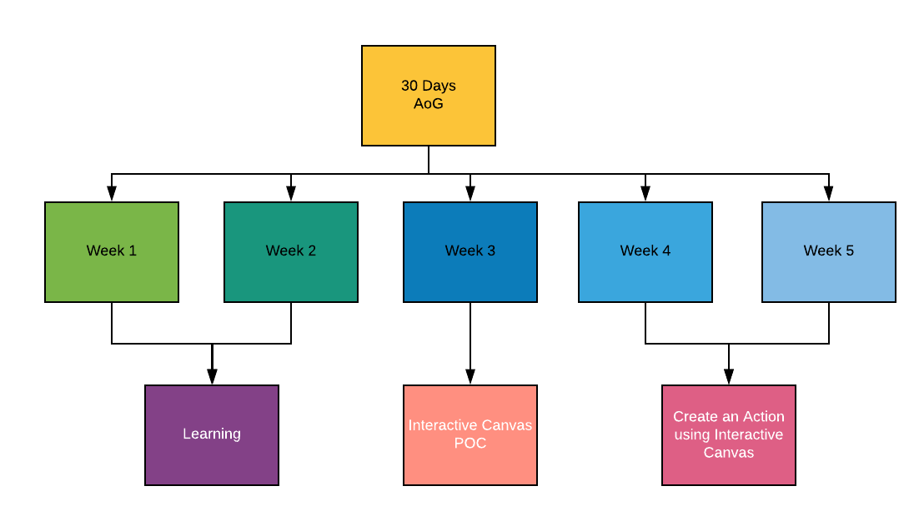

  

  <h1>Actions on Google - Mission 30Days</h1>
  
Journal of what i have learned, played, created using Actions on Google for 30 days

  
From: 01-03-2020 &nbsp;  To: 30-3-2020

   

  <h1>Plan for 30 Days</h1> 
  

| Day  | Task | Status |
| :-------------: | :------------- | :----------: |
| Day 1  | Designing Quality Conversation for Google Assistant  | Done |
| Day 2  | Tools for building better smart home actions  | Done |
| Day 3  | How to build actions for smart displays  | Done  |
| Day 4  | Smart Home 101 - How to develop for the connected home | Done |
| Day 5  | Build interactive canvas for assistant | Done  |
| Day 6  | 10 Best practices for high quality actions | Done |
| Day 7  | Extend your Android App to the Google Assistant  | Done |
| Day 8  | Voice Strategy and Design | Done  |
| Day 9  | PoC - Account Linking-Part 1 - Dialogflow | Done  |
| Day 10 | PoC - Account Linking-Part 2 - CloudFunctions | Done |
| Day 11 | PoC - Show Current Location using Places API - Part 1 | Done  |
| Day 12 | PoC - Show Current Location using Places API - Part 2 | Done |
| Day 13 | PoC - Date Time Conversation helper - Part 1  | Done |
| Day 14 | PoC - Date Time Conversation helper - Part 2 | Done |
| Day 15 |  |  |