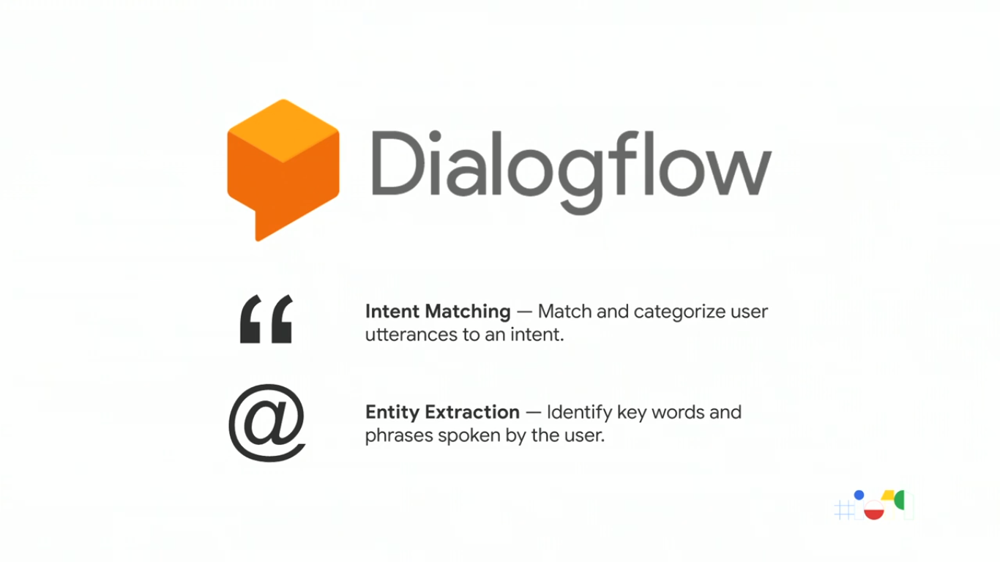

  <h1>Actions on Google - Day 1</h1>
  
Designing Quality Conversation for Google Assistant

## What i am going to learn today

1. Rules for Conversation design
2. Greetings and setting expectations
3. Use personalization for repeat users
4. Error Handling
5. Improve your actions through logs

When we are creating a custom action the first thing which we have to do is the design

# Rules for Conversation Design

1. The first rule is to write sample dialogs (Kind of a movie script)

 

   
 

2. Don't expect the sample dialogs to be perfect at the first time
3. Once the script is ready have a group of people and read them loud

   

4. Whenever you test your sample dialogs by reading loud just turn back and do the conversation, the reason for it is when humans try to communicate there are others ways they would communicate like eye contact, body language, poses

5. When the question is confusing the other guy might look at you which may make you to repeat the question again(for humans it would work but what about machines)

6. Reason for doing like this is computers don't understand your body language or poses or even eye contacts which means you have to write the scripts which machine can understand

7. How many sample dialogs do i want to write ? There is no hard rule it depends on you

8. But there are two ways you should foucs like

* Happy Path - Everthing goes in the flow
* Sad Path - Humans won't respond to what is been asked or they might answer it in a different way E.g. (Consider the name onion how it is spoken is tamil, malayalam, telugu, hindi, etc)

   

   

# Greetings and setting expectations

   

Let's see a sample greetings and will check how it is made better

   

In the above image you could see the assistant has asked a question for that the user might think like they can ask any questions which would result like below

`Are poodles smart? ` which your action can't handle because it can answer only questions about animals.

It will be very vague when u have these kinds of questions so it would be good if we avoid these kinds of questions at first.The above question can be rewritten like below

   

If you notice the above image there is an highlighter for animal which means a user can ask about a cat/dog/elephant. we have to handle it.

To handle it developers would use dialogflow

   

Once we use dialogflow it will be like the below image

   

Here's another example of how dialogflow extracts intents

   

We can make the above conversation even different by changing the ssml(speech synthesis markup language)

   

If you see the right-hand side there is an audio tab where we can design our ssml.reason for doing this is to give a better user experience

If you compare the text on the left side and the audio text on the right handside you can see the question mark at the last is replaced with . in audio. It is not correct if the user sees it for that we can use the node library and create the voice design like below

   

In the above image you can see that we have used to outputs like one for the speech and another for the text

The end goal of greetings and expectations is `Create a good user impression at the first
`

# Use personalization for repeat users

We can create a custom greeting for the users who comes back to our action

For that in our action we will handle like below

   

Here we have given the condition like is the user last seen then we would give a seperate greetings else we would give the introductory greeting

Remembering some information by asking user permission

Suppose if your action is about weather you can ask the user for the zip code first and then you can show the weather of that particular zip code and then you can ask permission to the user whether your action can remember the zip code?

   

We can handle it like the below code

   

* conv.data.zipcode will store the information only until the session gets expired
* conv.user.storage.zipcode is the longtime storage 

   

## Helpers

some of the helpers

   

# Error Handling

When someone says something that you didn't expect how we can tackle those situations

* Context sensitive error handling
* Rapid reprompt
* Error acknowledgment
* Escilated error

#### Context sensitive error handling

Will see the example below

   

The user gives up if we didn't handle things properly to handle the error we would reprompt the same question to the user to bring him back to track like the below example

   

This is called context sensitive error handling where we repeat the question again if he goes out from the question

#### Rapid reprompt

It is similar like context sensistive error handling

   

If you see the conversation where the action has asked about the receipe the user has replied about something in percent soon the action repeated the question back which makes the user back to track

#### Error acknowledgment

Suppose if your action can't do anything with the question the user asked you can acknowledge the user like below

   

#### Escilated error

 Combining the error acknowledgment and ask the new question can be done using escilated error like below

 

   

# Improve your actions through logs

Once your action is deployed you can improve your action by seeing the logs in dialogflow like below and update it to the users request

   

   

Even if the user asks something which your action can't recognize we can manually link to the intent like below

   

