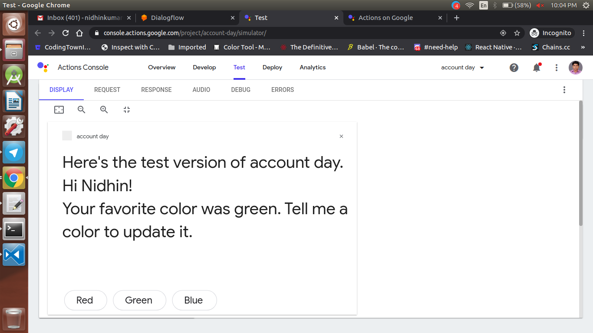

<div align="center">
  <h1>Actions on Google - Day 10</h1>
  <p>PoC - Account Linking - Part 2 - Cloud Functions</p>
</div>

Create a new folder named functions in your local directory and then navigate to that directory.

Once navigated to the folder do `npm init` and then fill the details provided

Install the plugins like below

* actions-on-google - `npm i actions-on-google`
* dotenv - `npm i dotenv`
* firebase-admin - `npm i firebase-admin`
* firebase-functions - `npm i firebase-functions`

Once the plugins are installed navigate to index.js file

Import the plugins in index.js like below

```
const {dialogflow, SignIn, Suggestions} = require('actions-on-google');
const admin = require('firebase-admin');
const functions = require('firebase-functions');
const dotenv = require('dotenv');
```

Initialize the firebase admin and dotenv

```
dotenv.config();
admin.initializeApp();

const auth = admin.auth();
const db = admin.firestore();
db.settings({timestampsInSnapshots: true});
```

Create a new const variable and declare the clientid

```
const app = dialogflow({
  clientId: process.env.CLIENT_ID // here add the clientid which you have got earlier
});
```

Create a new Default Welcome intent like below

```
app.intent('Default Welcome Intent', async (conv) => {});
```

Add a sample response to the default welcome intent like below

```
app.intent('Default Welcome Intent', async (conv) => {
   conv.ask(new Suggestions('Red', 'Green', 'Blue'));
   conv.ask(`What's your favorite color?`);
});
```
Once added test whether the above code is working or not in emulator

Now when the user gives their color a new intent named Give Color would be called like below

```
app.intent('Give Color', async (conv, {color}) => {
  conv.data[Fields.COLOR] = color;
});
```

In the above code it will get the color what user has provided

Now we can add the sign in option here to proceed further

```

app.intent('Give Color', async (conv, {color}) => {
  conv.data[Fields.COLOR] = color;
  conv.ask(new SignIn(`To save ${color} as your favorite color for next time`));
});

```

Now it will open the Get sign in intent like below

```
app.intent('Get Sign In', async (conv, params, signin) => {
  if (signin.status !== 'OK') {
    return conv.close(`Let's try again next time.`);
  }
  const color = conv.data[Fields.COLOR];
  await conv.user.ref.set({[Fields.COLOR]: color});
  conv.close(`I saved ${color} as your favorite color. ` +
    `Since you are signed in, I'll remember it next time.`);
});
```

In the above snippet it will check whether the user has given access to sign in if not it will return the try again next time

Once the signin is successfull we will get the user profile data from firebase auth as well as in firestore database

For that we will be using an middleware like below

```
app.middleware(async (conv) => {
  const {email} = conv.user;
  if (!conv.data.uid && email) {
    try {
      conv.data.uid = (await auth.getUserByEmail(email)).uid;
    } catch (e) {
      if (e.code !== 'auth/user-not-found') {
        throw e;
      }
      // If the user is not found, create a new Firebase auth user
      // using the email obtained from the Google Assistant
      conv.data.uid = (await auth.createUser({email})).uid;
    }
  }
  if (conv.data.uid) {
    conv.user.ref = dbs.user.doc(conv.data.uid);
  }
});

```


In the above code will check whether the user email is present or not and if available will get the user uid from firestore

Now in the Give Color intent we will add the condition to get the user details

```
app.intent('Give Color', async (conv, {color}) => {
  conv.data[Fields.COLOR] = color;
  if (conv.user.ref) {
    await conv.user.ref.set({[Fields.COLOR]: color});
    conv.close(`I got ${color} as your favorite color.`);
    return conv.close(`Since you are signed in, I'll remember it next time.`);
  }
  conv.ask(new SignIn(`To save ${color} as your favorite color for next time`));
});
```


Now we will add the condition to check whether the user is logged in or not in the default welcome intent

```
app.intent('Default Welcome Intent', async (conv) => {
   if (conv.user.verification !== 'VERIFIED') {
    return conv.close(`Hi! You'll need to be a verified user to use this sample`);
   }

   conv.ask(new Suggestions('Red', 'Green', 'Blue'));
   conv.ask(`What's your favorite color?`);
});
```

Now in the default welcome intent we will add the condition to get user profile details as well as the color that the user has said like below

```
app.intent('Default Welcome Intent', async (conv) => {
  // Account Linking is only supported for verified users
  // https://developers.google.com/actions/assistant/guest-users
  if (conv.user.verification !== 'VERIFIED') {
    return conv.close(`Hi! You'll need to be a verified user to use this sample`);
  }

  const {payload} = conv.user.profile;
  const name = payload ? ` ${payload.given_name}` : '';
  conv.ask(`Hi${name}!`);
  conv.ask(new Suggestions('Red', 'Green', 'Blue'));

  if (conv.user.ref) {
    const doc = await conv.user.ref.get();
    if (doc.exists) {
      const color = doc.data()[Fields.COLOR];
      return conv.ask(`Your favorite color was ${color}. ` +
        'Tell me a color to update it.');
    }
  }

  conv.ask(`What's your favorite color?`);
});
```

Now go to firebase console and get the project you have created in AoG and Go to settings >  Service accounts > Firebase Admin SDK > Node.js > Generate new private key

Once the private key is downloaded rename it to service-account.json

In the firebase console click Database and select firestore database and click start in test mode option

Now deploy the cloud function using the command firebase deploy --project {PROJECT_ID} //get the PROJECT_ID from dialogflow console settings

Copy the webhook url once it is deployed and paste the webhook url in dialogflow

Once added test your application you will be get the output like below as well as an confirmation email to the email id which you have tried to login

<div align="center">
   
</div>