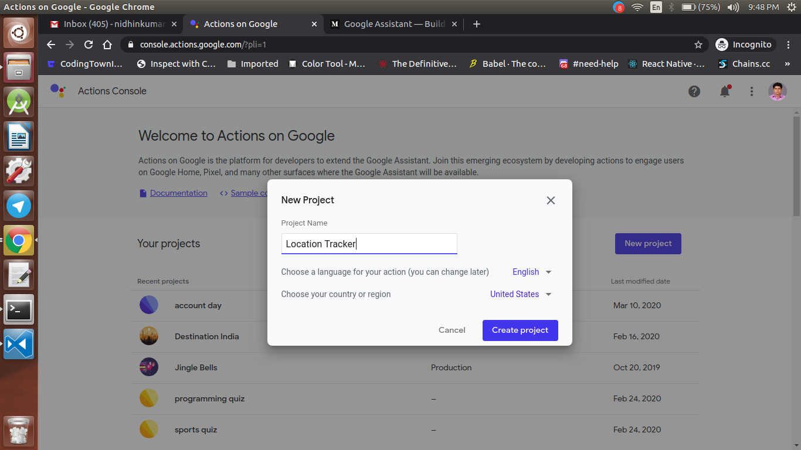
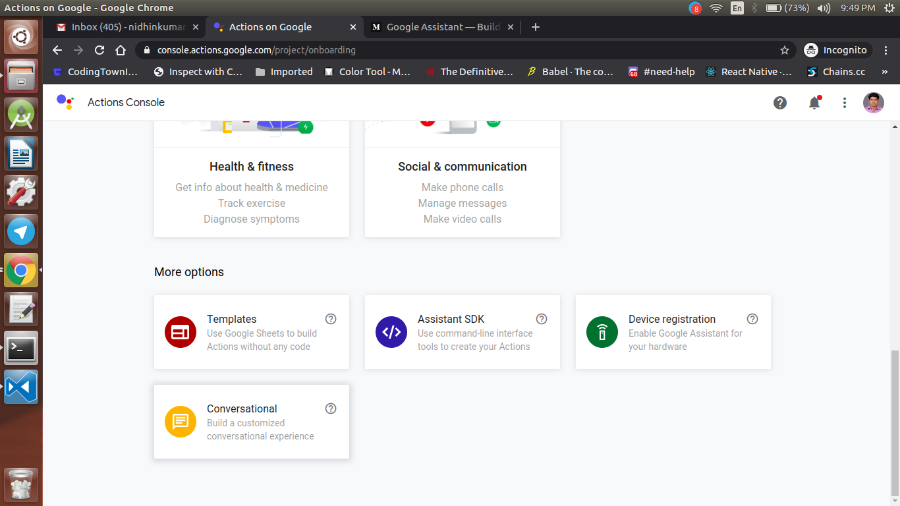
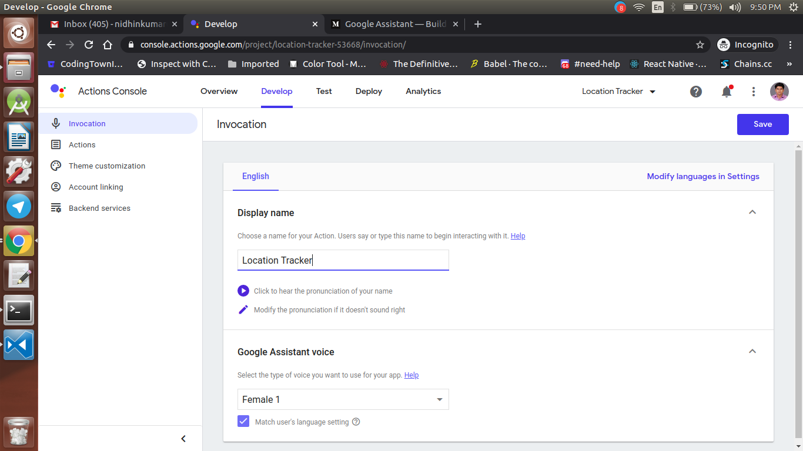
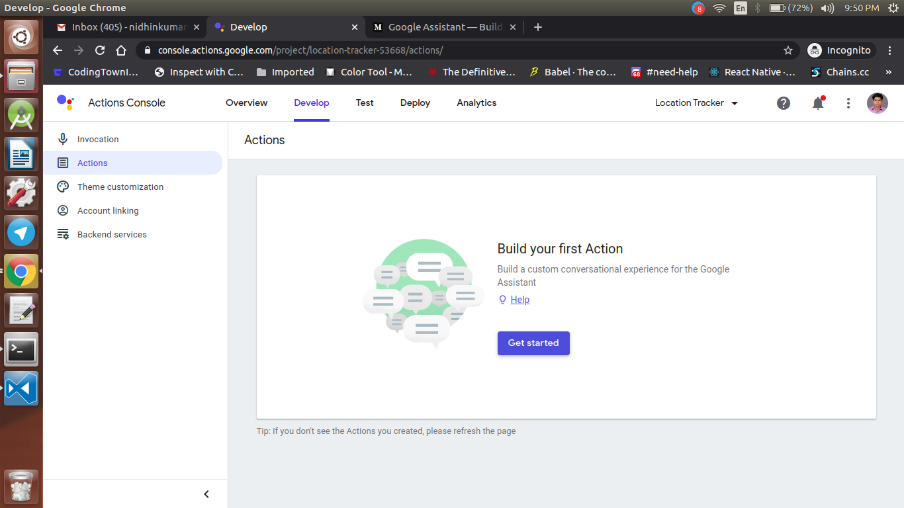
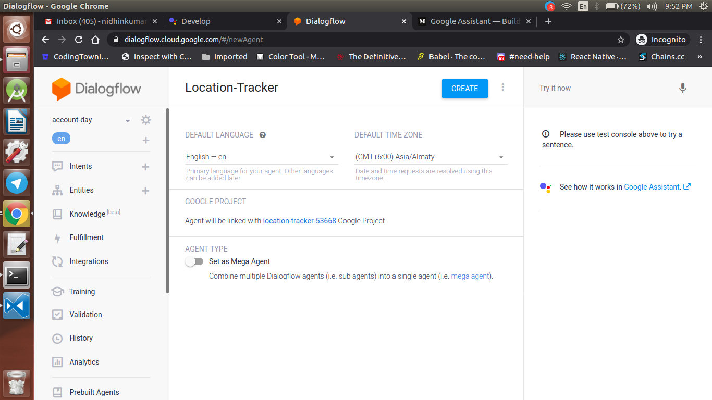
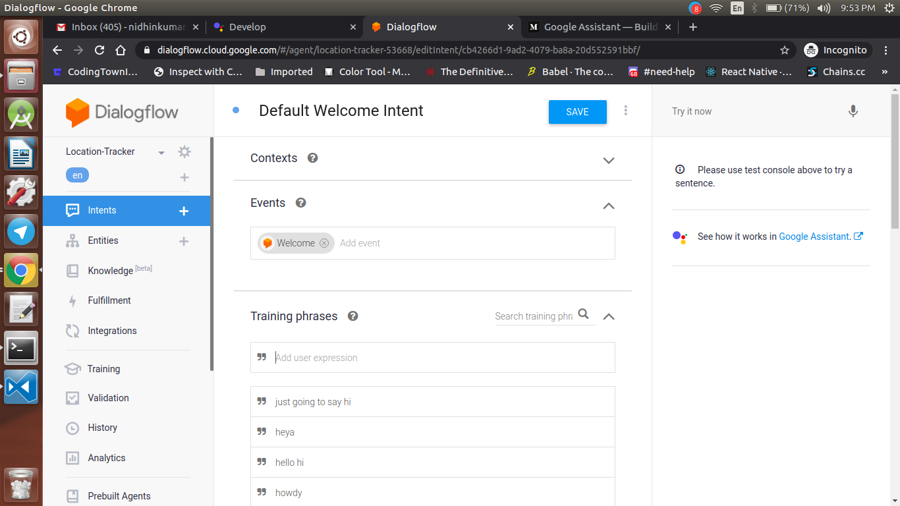
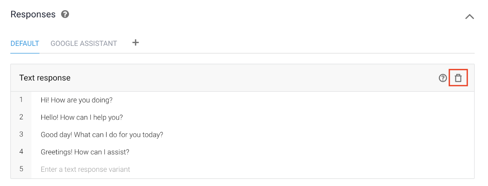
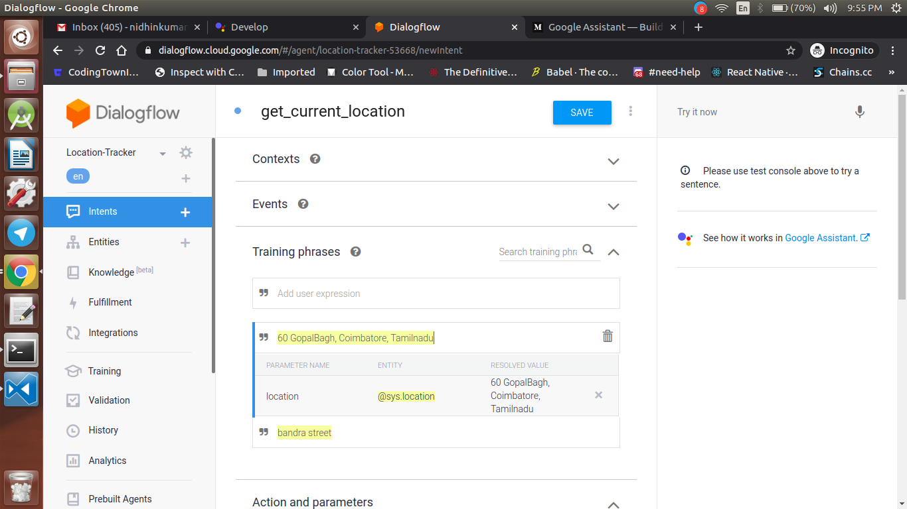
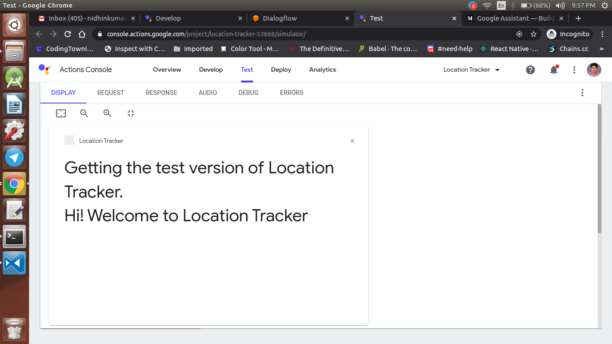

  <h1>Actions on Google - Day 10</h1>
  
PoC - Show Current Location using Places API - Part 1

In this PoC i will create an AoG action to show the current location of the user using Places API

In the Part 1 i will create the dialogflow part

Create a new project named `Location Tracker` like below

   

Once the project is created click conversational

   

Once the conversational is selected click the invocation option at the left bar

   

Once the invocation name is given click the actions button and select create your action

   

Now select the custom action which will navigate to the dialogflow console. In the dialogflow console check whether the agent name is Location Tracker or not

   

If it is same click Create else give a name to the agent

Once the agent is created on the left side you will see Intent.Click Intents

You could see two intents select the `Default Welcome Intent`

   

Now scroll down you could see some default responses like 

   

Delete all the default response and now add a response like below

`Hi! Welcome to Location Tracker`

Now click the `+` button in the intent and give a new intent name `get_currentlocation`

   

Now in the training phase add some locations by default the `@sys.location` entity should match up.

Scroll down and enable the webhook for the intent

Once it is done save the intent.

Now test your action you will get the default response like below

   

Now we have done with the dialogflow setup next we will set up the cloud function for this actions.

Catch it up on Day 12 post