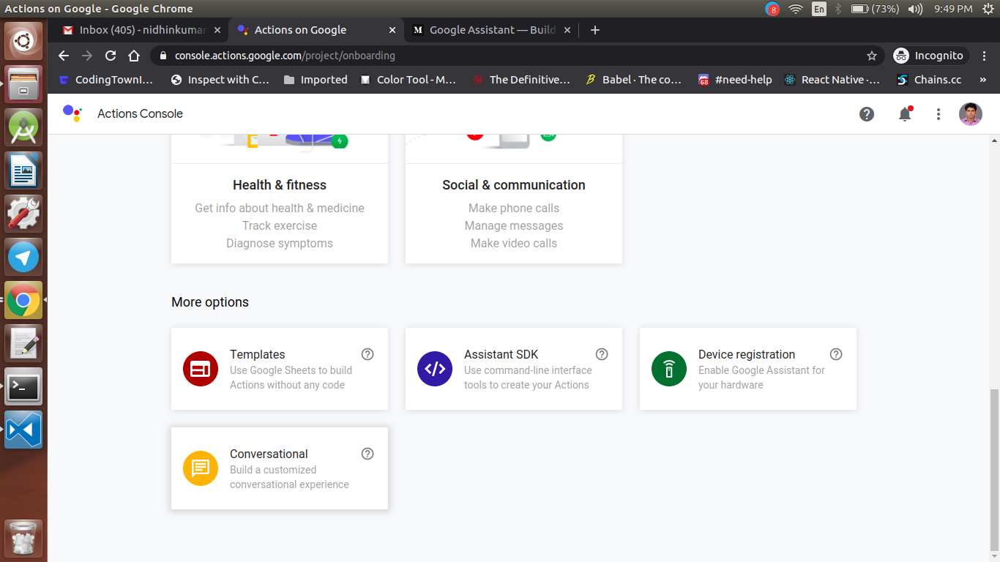

  <h1>Actions on Google - Day 13</h1>
  
PoC - Date Time Conversation Helper - Part 1

In this PoC i will Create an AoG action to get the date and time from user and parse it using converation helper in dialogflow

Create a new project named `datetime-conversation` like below

  

Once the project is created click conversational

  

Once the conversational is selected click the invocation option at the left bar

  

Once the invocation name is given click the actions button and select create your action

  

Now select the custom action which will navigate to the dialogflow console. In the dialogflow console check whether the agent name is datetime conversation or not

  

If it is same click Create else give a name to the agent

Once the agent is created on the left side you will see Intent. Click `Intents`

You could see two intents select the `Default Welcome Intent`

Remove all the training phrases as well as the default response and enable webhook for the default welcome intent and click `Save`

Once it is done create a new intent named `datetime_handler` and enable the datetime helper in the event and then enable the webhook for the intent. It should be like below

  

