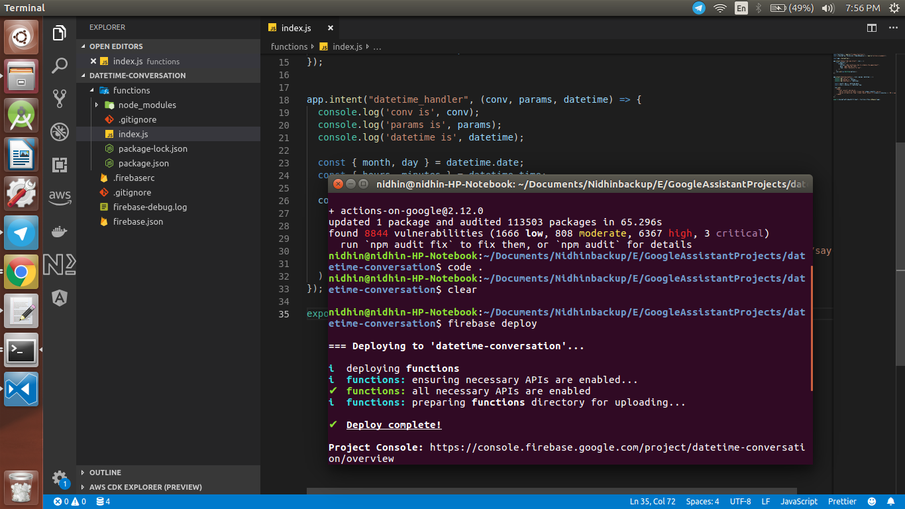
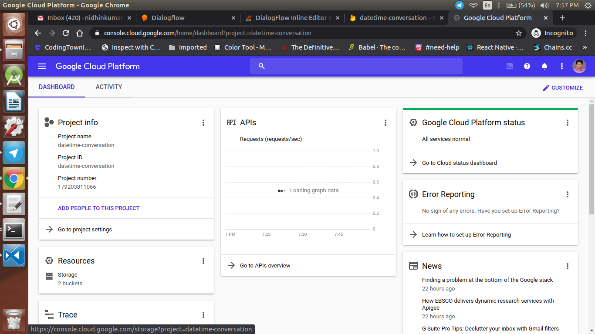
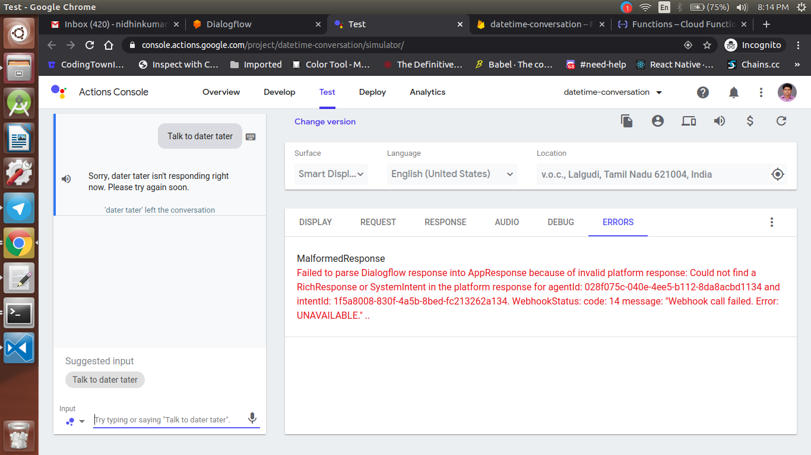

<div align="center">
  <h1>Actions on Google - Day 14</h1>
  <p>PoC - Date Time Conversation Helper - Part 2</p>
</div>

We will continue with the Date Time Conversation Helper of adding cloud functions for the AoG action.

create a new directory in your local machine and name the directory as `datetime-conversation` and navigate to the directory

Initialize firebase cloud functions using the command  `firebase init` and select the action which you have created earlier

Install the `actions-on-google` plugin using the command `npm i actions-on-google`. Open the code in any editor and navigate to the `index.js` file

In the `index.js` remove the old codes and import the plugins like below

```
const functions = require("firebase-functions");
const { dialogflow, DateTime, SimpleResponse } = require("actions-on-google");

const app = dialogflow();
```

Now we will create the default welcome intent like below, in which we will get the date and time to schedule an appointment

```
app.intent("Default Welcome Intent", conv => {
    conv.ask(new SimpleResponse('Welcome to dater tater'));
    const options = {
        prompts: {
          initial: 'When would you like to schedule the appointment?',
          date: 'What day was that?',
          time: 'What time works for you?',
        },
    };
    conv.ask(new DateTime(options));
});
```
Now we will display the response in `datetime_handler` intent like below

```
app.intent("datetime_handler", (conv, params, datetime) => {
  const { month, day, year } = datetime.date;
  const { hours, minutes } = datetime.time;

  conv.ask(`
    <speak> 
        Great, we will see you on
        <say-as interpret-as="date" format="dm">${day}-${month}-${year}</say-as>
        <say-as intrepret-as="time" format="hms12" detail="2">${hours}:${minutes || '00'}</say-as>
    </speak>`
  )
});
```

In the above datetime_handler we have got the datetime reponse which we have formatted like below

Click `save` and deploy your action using the command like `firebase deploy` you can see the output like the below video

[Click here to watch the demo](https://firebasestorage.googleapis.com/v0/b/momtemplates.appspot.com/o/date-timer-helper-2020-03-14_20.25.20.mp4?alt=media&token=336a516e-2e3e-4d1e-9304-a7516383fb1e)


If you want to see the logs in your local terminal using command `firebase functions:log` in our local terminal you can see the logs like below

[Click here to watch the demo](https://firebasestorage.googleapis.com/v0/b/momtemplates.appspot.com/o/date-timer-logger-2020-03-14_20.26.43.mp4?alt=media&token=a29ec2b3-99b9-414f-9142-14020235def0)

# Errors

If you face errors like below try the solutions provided

## 1. Cloud function is deployed but not available in firebase cloud functions / Google cloud functions

<div align="center">
   
</div>

<div align="center">
   
</div>

### Solution

Check whether the `index.js` file has the below code at the bottom

```
exports.dialogflowFirebaseFulfillment = functions.https.onRequest(app);
```

If not try to add it and deploy it again


## 2. Can't able to enable the inline editor in dialogflow console

### Solution

Go to firebase console and check whether the firebase storage is enabled or not. If it is not enabled then enable it

## 3. Failed to parse dialogflow into AppResponse

<div align="center">
   
</div>

### Solution

Check the cloud function log first there you could see the root cause for the error for the above error it was due to the `DateTime` was not imported

