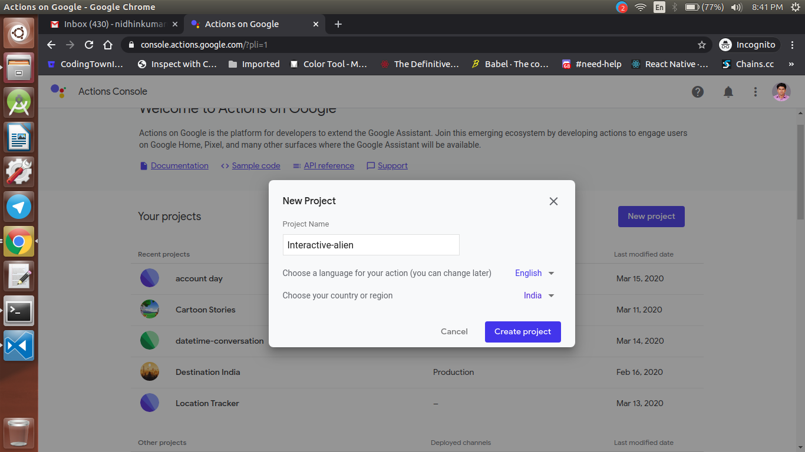
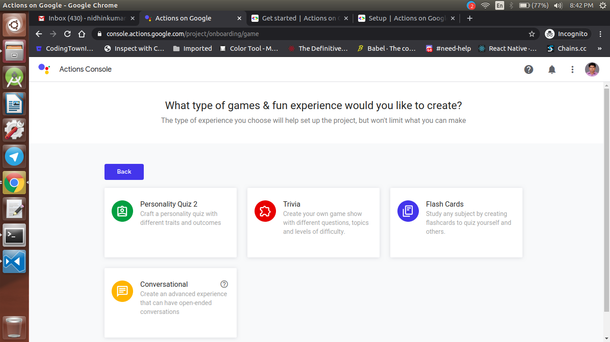
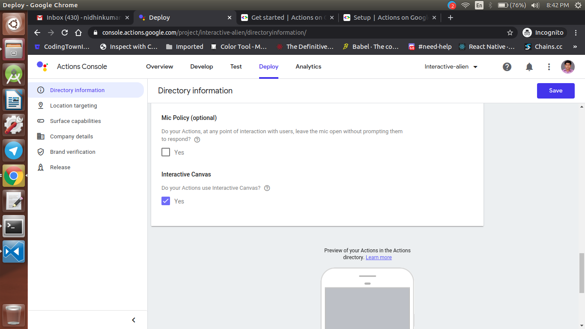
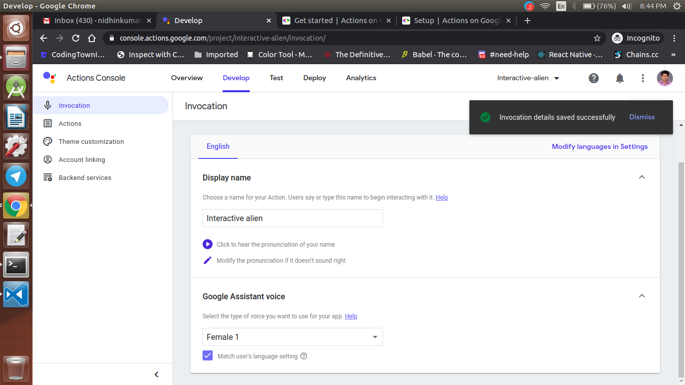
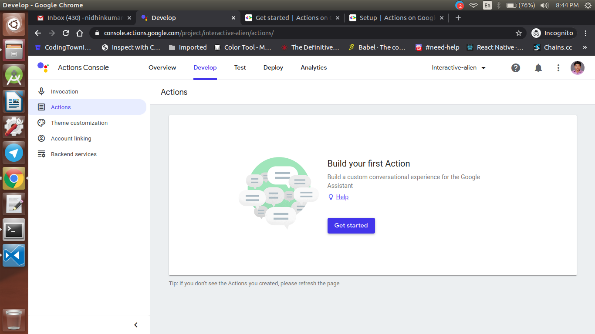
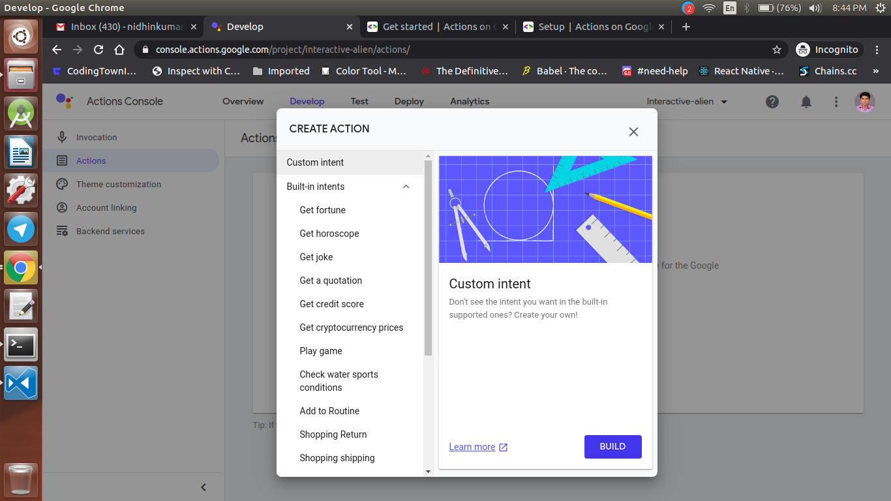
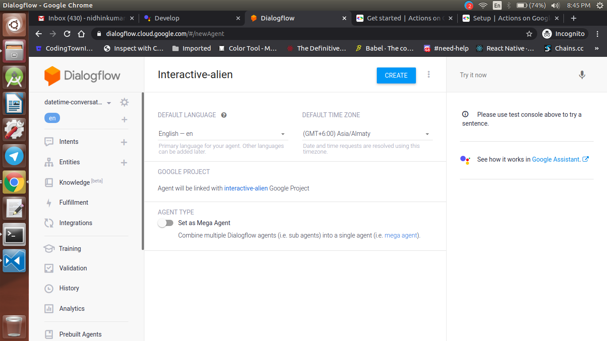

<div align="center">
  <h1>Actions on Google - Day 16</h1>
  <p>PoC - Interactive Canvas-Basics - Part 2</p>
</div>

Today we will see how to use the html page we have created on Day 15 to AoG Interactive Canvas

First we will create an Google Assistant project in Actions on Google console like below i have named it as `interactive alien`

<div align="center">
   
</div>

Once the project is created select `Games&Fun` category and select `Conversational` like below

<div align="center">
   
 </div>

 Now select `Deploy` option and click `Directory` information. At the bottom of the page, check the option under Interactive Canvas.

<div align="center">
   
</div>

Now click `Invocation` and type how your action should be called

<div align="center">
   
</div>

Once it is done click `Actions` and click `Get Started` button and select `Custom Intent`

<div align="center">
   
</div>

<div align="center">
   
</div>

Now it will open the  `Dialogflow console`, create the agent

<div align="center">
   
</div>

Now go to the `Default Welcome Intent` and remove all the default response and scroll down and click `Fulfilment` and `Enable Fulfilment` and click `Save`

Now we have done with the dialogflow part now we will create the Cloud Function in your local machine

In your local machine create a new directory named `interactive-alien` and then navigate to the folder and `initialize Firebase` using the command `firebase init`

Now select `functions` and press Y for all the rest of the things

Now some of the files like below will be created

```
index.js
package.json
```

Now install `actions-on-google` plugin using the command `npm i actions-on-google`. Once it is installed open `index.js` in any text editor

Now remove all the existing codes in the `index.js` and import the dependencies like below

```
const functions = require('firebase-functions');
const {dialogflow, HtmlResponse} = require('actions-on-google');

const app = dialogflow({debug: true});
```

Now we will create the `Default Welcome Intent` like below with a simple response and the url of the HTML page which we have created on Day15

```
app.intent('Default Welcome Intent', (conv) => {
  conv.ask('Welcome! To Interactive Aliens');
  conv.ask(new HtmlResponse({
    url: //add the HTML hosted url here,
  }));
});
```

In the above code we have just showed a default welocome message and the link of the HTML page which is hosted in the Firebase hosting

Now export the conversation like below

```
exports.conversation = functions.https.onRequest(app);
```

Entire code

```
const functions = require('firebase-functions');
const {dialogflow, HtmlResponse} = require('actions-on-google');

const app = dialogflow({debug: true});

app.intent('Default Welcome Intent', (conv) => {
  conv.ask('Welcome! To Interactive Aliens');
  conv.ask(new HtmlResponse({
    url: //add the HTML hosted url here,
  }));
});

exports.conversation = functions.https.onRequest(app);
```

Now go to the HTML page which we have created on Day15 and import the canvas api like below

```
  <!-- Disable favicon requests -->
  <link rel="shortcut icon" type="image/x-icon" href="data:image/x-icon;,">
  <!-- Load Interactive Canvas JavaScript -->
  <script src="https://www.gstatic.com/assistant/interactivecanvas/api/interactive_canvas.min.js"></script>
```

Now deploy the webpage to Firebase Hosting once the webpage is hosted you will get the web url copy  that url and paste it the cloud function and deploy the cloud function

Now copy the webhook url and paste it in Dialogflow webhook url and click Save


It's time to test your application. You could see the output like below

## Demo

[Click here to watch the demo](https://firebasestorage.googleapis.com/v0/b/momtemplates.appspot.com/o/interactive-canvas-2020-03-16_21.37.22.mp4?alt=media&token=63fd15d9-694f-43f2-8255-464a5dd55ab7)


## Reference Link

HTML5-Canvas - `https://medium.com/@bretcameron/create-interactive-visuals-with-javascript-and-html5-canvas-5f466d0b26de`

Interactive Canvas - `https://developers.google.com/assistant/interactivecanvas/build`