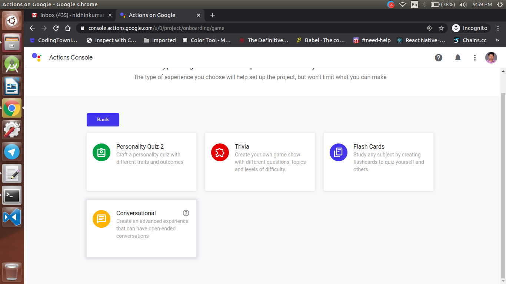
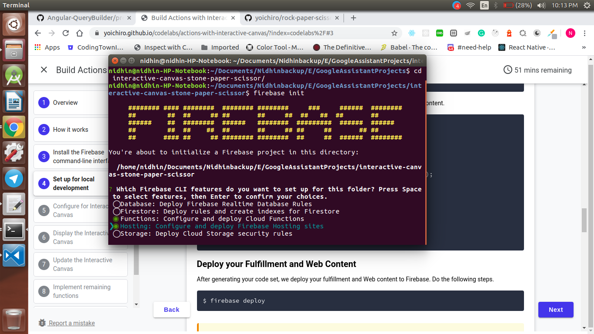
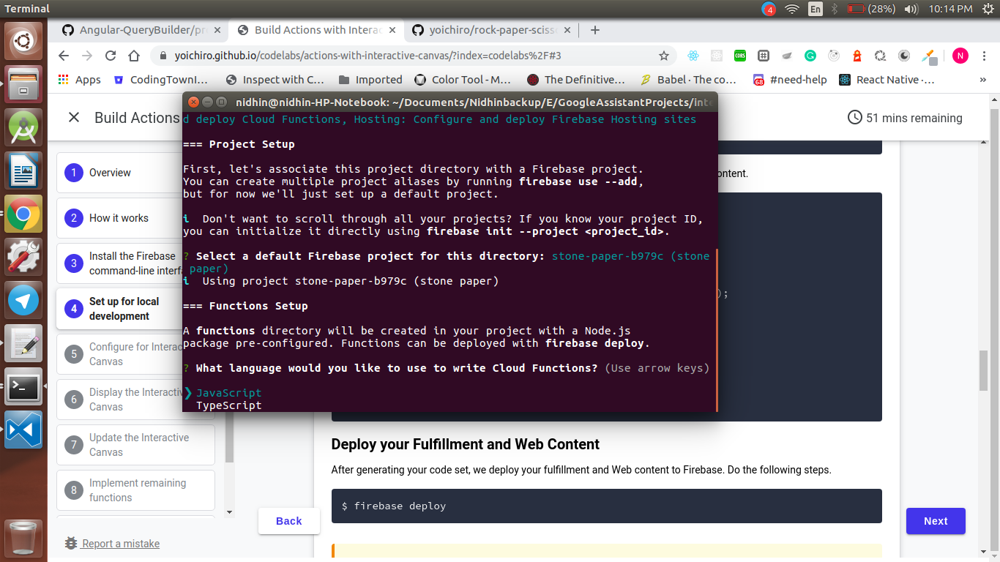

<div align="center">
  <h1>Actions on Google - Day 18</h1>
  <p>PoC - Interactive Canvas-Stone-Paper-Scissor - Part 1</p>
</div>

Today we will see how to create Stone Paper Scissors action using interactive canvas

First we will create an Google Assistant project in Actions on Google console like below i have named it as `Stone paper`

<div align="center">
   
</div>

Once the project is created select `Games&Fun` category and select `Conversational` like below

<div align="center">
   
 </div>

 Now select `Deploy` option and click `Directory` information. At the bottom of the page, check the option under Interactive Canvas.

<div align="center">
   
</div>

Now click `Invocation` and type how your action should be called

<div align="center">
   
 </div>

Once it is done click `Actions` and click `Get Started` button and select `Custom Intent`

<div align="center">
   
</div>

Now it will open the  `Dialogflow console`, create the agent

<div align="center">
   
</div>

Now We will create the HTML , Cloud Functions in our local machine 

create a directory named `stone-paper` and navigate to the directory using the command `cd stone-paper`

now initialize firebase using the command  `firebase init` and enable `Functions and Hosting` like below

<div align="center">
   
</div>

Select `Javascript` like below

<div align="center">
   
</div>

Once the install is completed you will have the folder structure like below

<div align="center">
   
</div>

Now navigate to the functions directory using the command `cd functions` and install `actions-on-google` plugin using the command `npm i actions-on-google`

Once it is installed open `index.js` file in any text editor and replace the `index.js` file with the below code

```
const functions = require('firebase-functions');
const {
  dialogflow,
  HtmlResponse
} = require('actions-on-google');

const firebaseConfig = JSON.parse(process.env.FIREBASE_CONFIG);

const app = dialogflow({
  debug: true
});

// TODO: Write your code here.

exports.fulfillment = functions.https.onRequest(app);
```
Now deploy the code using the command `firebase deploy` once it is deployed you will get the webhook url.

Copy the webhook url and go to `Fulfilment` and enable the `Webhook` and paste the copied webhook url

Once it is pasted click `Save` and test the project

See whether you are getting the default welcome message like below the video

### Demo

[Click here to watch the demo](https://firebasestorage.googleapis.com/v0/b/momtemplates.appspot.com/o/interactive-canvas-stone-paper-2020-03-18_22.34.04.mp4?alt=media&token=6b2e36ec-79b6-4881-8ab0-ee6f39f30774)


### Reference Links

Stone Paper Scissors CodeLabs - `https://yoichiro.github.io/codelabs/actions-with-interactive-canvas/?index=codelabs%2F#1`

