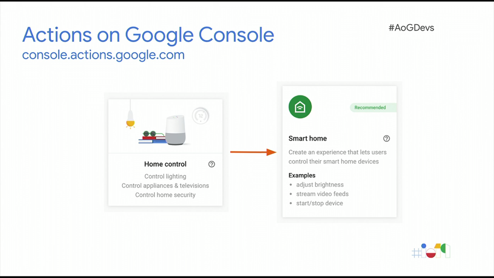
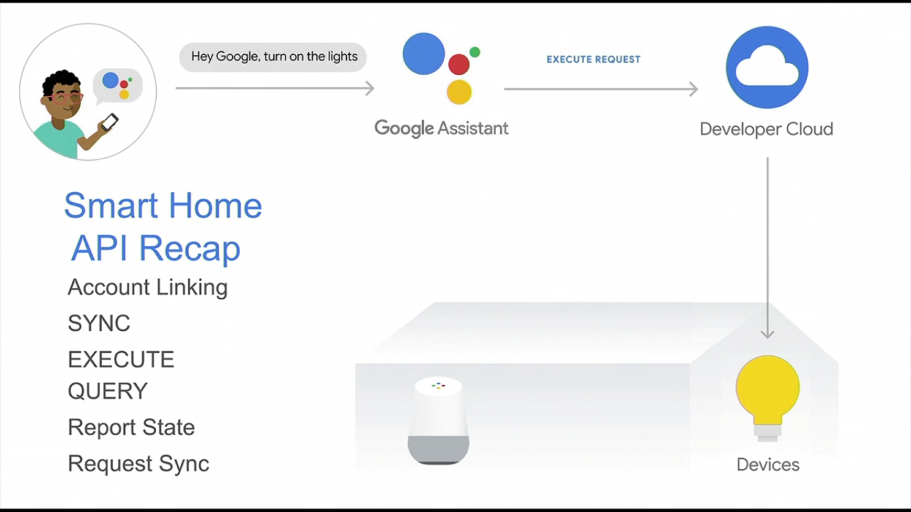
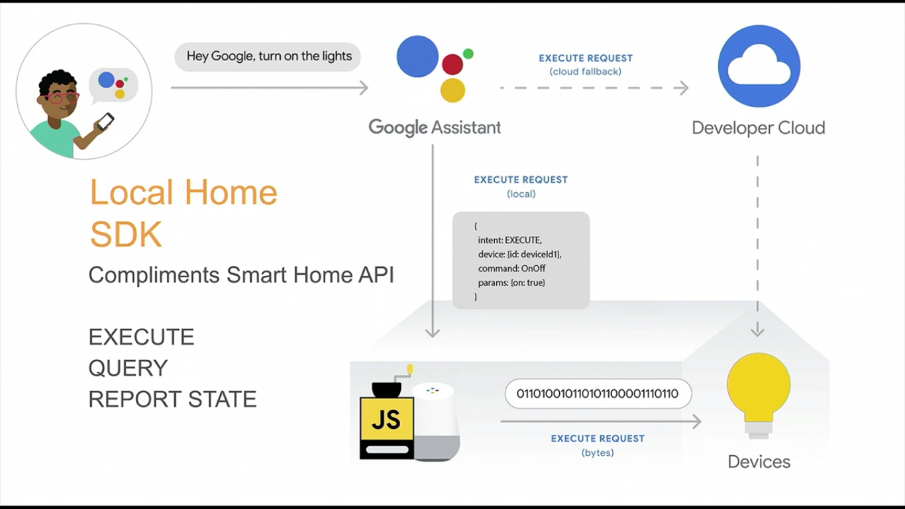
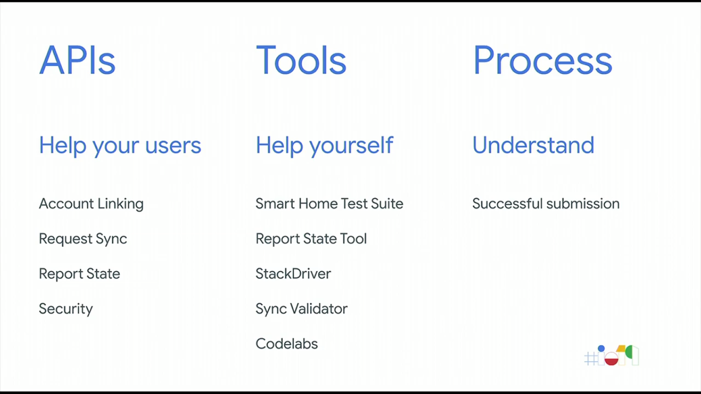
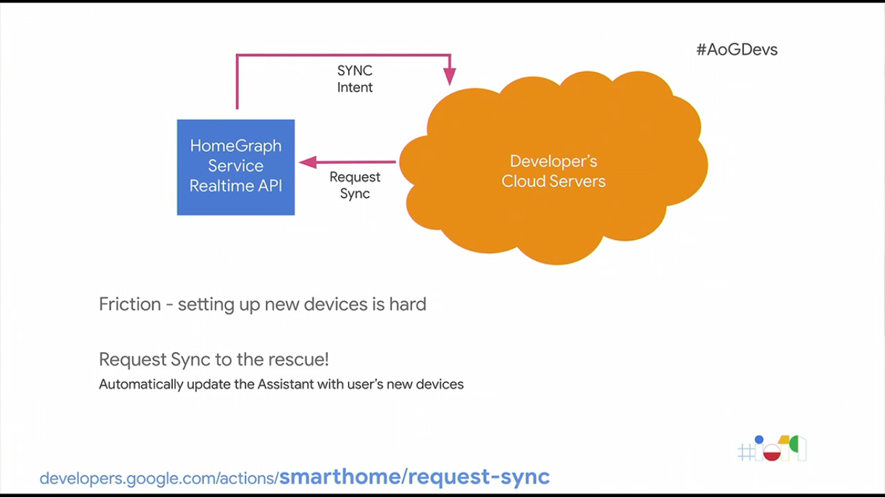
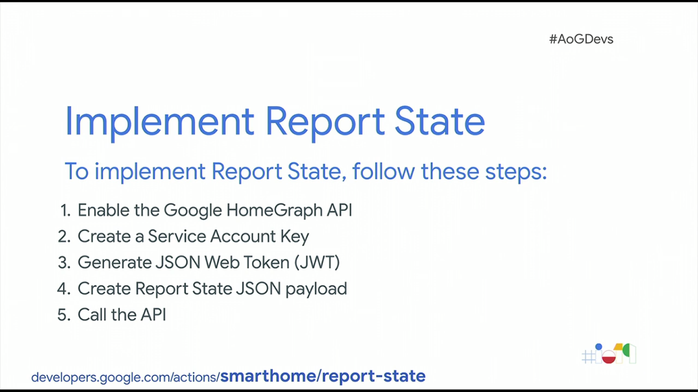

  <h1>Actions on Google - Day 2</h1>
  
Tools for building better smart home actions

# Creating a action for smart home

To create an action for smart home go to actions on google page and create an action and select like below image

   
 

Smart home flow

   
 

 There is an local sdk available for the local developers

 

   
 

To create a smart home action we should know about the things like 

* APIs
* Tools
* Process

   
 

# APIs

In APIs we will see things like 

* Account Linking
* Request Sync
* Report State
* Security

### Account Linking

How the smart home links your google account using oauth

### Request Sync

How google assistant connects with the smart home action is done using Request Sync

   
 

   
 

### Report state

Having graphical control for the devices without having any refresh page

   
 

### Security

For security purpose 2 factor authentication has been used

# Tools

Tools are availale to test your home action - smarthome test suite

### Report state tool

Tool to see how the reporting works

### Stack driver

To have the logs for your action, assistant side logs, we can parse the logs for analytics

# Reference Link

https://developers.google.com/assistant/smarthome/overview

