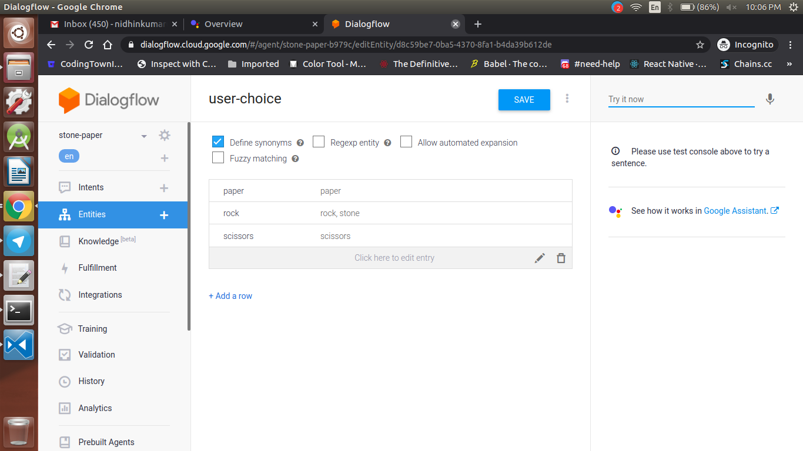

<div align="center">
  <h1>Actions on Google - Day 20</h1>
  <p>PoC - Interactive Canvas-Stone-Paper-Scissor - Part 3</p>
</div>

Today we will continue with the pending task of playing the game with action when the user selects a image(stone, paper, scissor)

First we will create `Entities` in the dialogflow like below

<div align="center">
  
</div>

Once the entities are added click `Save`

Now create an intent named `Show` and add the `Training Phrase` like below image

<div align="center">
   
</div>

Once the Training Phrases are added `Enable Webhook` for the intent and click `Save`

Now open the `functions` directory and open `index.js` file and add the below code

```
const judgeMap = {
  rock: {
    rock: 'Same.',
    paper: 'You lost.',
    scissors: 'You win!'
  },
  paper: {
    rock: 'You win!',
    paper: 'Same.',
    scissors: 'You lost.'
  },
  scissors: {
    rock: 'You lost.',
    paper: 'You win!',
    scissors: 'Same.'
  }
};
```

Add the code for `Show` intent

```
app.intent('Show', (conv, param) => {
  // Retrieve the user's hand.
  const userChoice = param['user-choice'].toLowerCase();
  // Determine the action's hand in random order.
  const actionChoice = ['rock', 'paper', 'scissors'][Math.floor(Math.random() * 3)];
  // Get the message represents the duel.
  const message = judgeMap[userChoice][actionChoice];
  // Construct the reply message with SSML.
  const ssml = `
    <speak>
      <p>Ok, I decided my hand, too.</p>
      <p>Rock, paper, scissors, shoot!</p>
      <p>You showed ${userChoice}.</p>
      <p>I showed ${actionChoice}.</p>
      <p>${message}</p>
      <break time="400ms" />
      <p>Do you want to play again?</p>
    </speak>`;
  conv.ask(ssml);
  // HtmlResponse object with information to update the screen.
  conv.ask(new HtmlResponse({
    data: {
      scene: 'result',
      userChoice,
      actionChoice,
      message
    }
  }));
});
```

In the above code what we have done is we will get the user choice and we will create a random choice for the action and compare both the user and action and then we will check it with `judgeMap` and then we will display the result like below

```
const ssml = `
    <speak>
      <p>Ok, I decided my hand, too.</p>
      <p>Rock, paper, scissors, shoot!</p>
      <p>You showed ${userChoice}.</p>
      <p>I showed ${actionChoice}.</p>
      <p>${message}</p>
      <break time="400ms" />
      <p>Do you want to play again?</p>
    </speak>`;
  conv.ask(ssml);
```


We will show response in Interactive canvas using the below code

```
conv.ask(new HtmlResponse({
    data: {
      scene: 'result',
      userChoice,
      actionChoice,
      message
    }
  }));
```

Now we have to handle this in interactive canvas `main.js` file. Open `main.js` file and add the below code

```
interactiveCanvas.ready({
    onUpdate(data) {
      // Display the duel image.
      if (data.scene === 'result') {
        document.querySelector('#welcome').style.display = 'none';
        document.querySelector('#vs').style.display = 'block';
        document.querySelector('#user-choice').src = `images/${data.userChoice}.png`;
        document.querySelector('#action-choice').src = `images/${data.actionChoice}.png`;
        document.querySelector('#message').innerText = data.message;
        // Display the result.
        setTimeout(() => {
            document.querySelector('#vs').style.display = 'none';
            document.querySelector('#result').style.display = 'block';
            document.querySelector('#message').style.display = 'block';
        }, 5000);
      }
    }
});
```

In the above code whenever there is an update in the canvas this particular function would be called here we will check the result and based on it we will hide the `welcome` div and enable the `vs` intent as well as it will show the `user choice` and `action choice` along with the message

Now we will handle whether the user want to continue the game or not using the `Follow-up` intent like below

* Show-Yes
* Show-No

<div align="center">
  
</div>


In the `Show-No` intent close the conversation with a message like below

<div align="center">
  
</div>

Now if the user says that is if the user want to restart the game by saying `Yes` means we need to handle it like below in the `functions/index.js`

```
//restarting the game

app.intent('Show - yes', conv => {
  conv.ask('Ok. Which do you want to show? Rock? Paper? Or, Scissors?');
  conv.ask(new HtmlResponse({
    data: {
      scene: 'restart'
    }
  }));
});

```

Now we will handle the same in interactive canvas `main.js` file like below

```
// Initialize the screen.
  if (data.scene === 'restart') {
    document.querySelector('#welcome').style.display = 'block';
    document.querySelector('#vs').style.display = 'none';
    document.querySelector('#result').style.display = 'none';
    document.querySelector('#message').style.display = 'none';
  }
```


Now deploy the functions and interactive canvas using the command `firebase deploy`

Once deployed you will have the output like below

### Demo

[Click here to watch the demo](https://firebasestorage.googleapis.com/v0/b/momtemplates.appspot.com/o/stone-paper%23demo-2020-03-20_21.35.56.mp4?alt=media&token=51f1e521-33c0-426f-9a04-912098ce9c6c)


