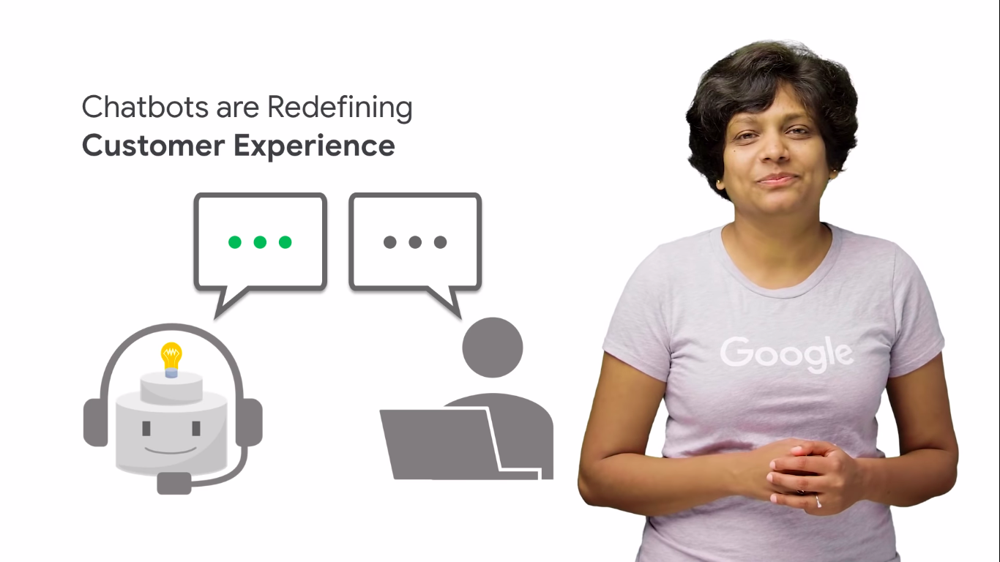
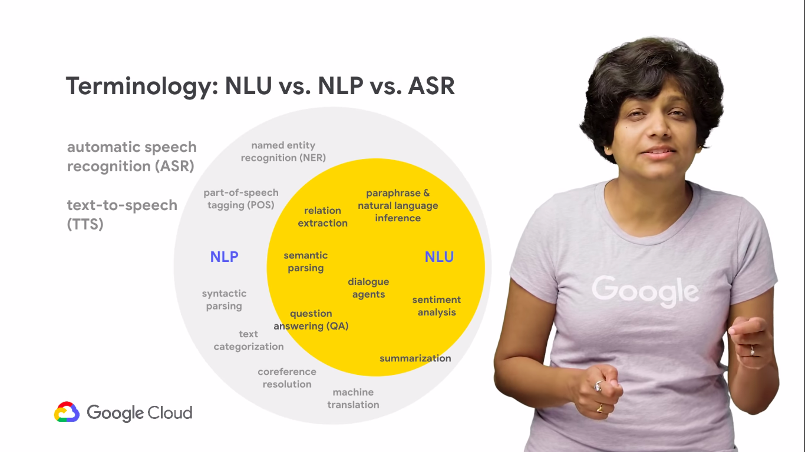
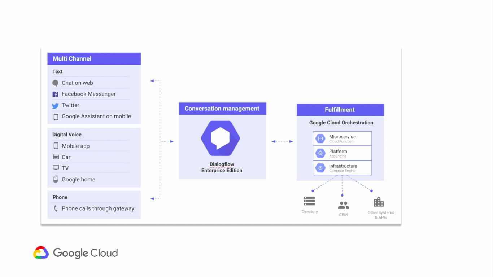
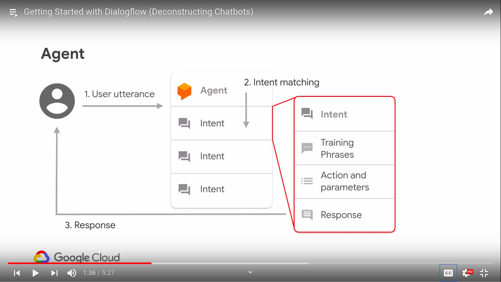

  <h1>Actions on Google - Day 21</h1>
  
Deconstructing Chatbots - Part 1

# Introduction

How the conversation with machines happens and what are the things we have to consider when we are doing a conversation with machines as well as how does the machine understands what humans are speaking

* Conversational Experiences
* Dialog flow

  

  

# Dialogflow

Dialogflow is an End-to-End tool powered by NLU(Natural Language Understanding) to facilitate rich and natural conversations

Architecture of Dialogflow 

  

It sits in the middle of the stack. A user can get into the Dialogflow using all the channels on the left hand side such as text, website, apps, messengers and smart voices

Dialogflow does the job of translating natural language into machine readable data using machine learning.

Once it identifies what the user is speaking then it will handle the backend service.At the backend we can integrate it with the other services like database, services, etc.,

## Components of Dialogflow

1. `Agent` - It is the entire chatbot application, the experience of collecting what the user says and mapping it to an intent and taking an action on it and then providing the user with a response

  

2. `Utterance` - All gets started with the utterance (This is how the user invokes a chat bot)

Example: `Hey Google talk to cooka wakka` the whole sentence is an utterance, but the phrase `Hey Google` is the trigger and `talk to cooka wakka` is the invocation phrase for our action
and `cooka wakka` is the invocation name

3. `Intent` - Once your action is invoked and if the user wants to trigger or do something we will use the `Intents`

Example: `I want to set up an appointment` where `set up an appointment` is the intent and if we have one more intent like `what is the hours of operation` it is again an intent

To provide this we will use Dialogflow where we would give multiple training phrase and ML model will match up the relevant things using `Intent Matching`

4. `Entities`

Example: `Set up an appointment on 5am tommorow`

In the above example the `5am` and `tommorow` are the critical piece of information which we would used in our conversation.

5. `Intent Response` - The response which is given once a particular task is completed

6. `Context` - Storing the variables/data and pass it from one intent to another intent

7. `Fulfilment` - To respond for the dynamic request

# Reference Links

* Introduction - [Click here to view](https://youtu.be/O00K10xP5MU?list=PLIivdWyY5sqK5SM34zbkitWLOV-b3V40B)
* Dialogflow Components - [Click here to view](https://youtu.be/Ov3CDTxZRQc?list=PLIivdWyY5sqK5SM34zbkitWLOV-b3V40B)
