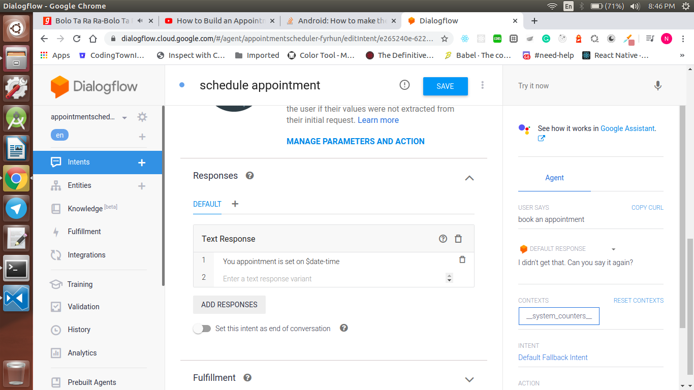

<div align="center">
  <h1>Actions on Google - Day 22</h1>
  <p>Deconstructing Chatbots - Part 2</p>
</div>

# Appointment Scheduler using Dialog flow

Create an appointment scheduler using dialog flow which will get the date and time as inputs from the user and display a response back to the user

Open Dialog flow console and create a new agent named Appointment Scheduler

<div align="center">
  
</div>

Once the agent is created you will see two default intents namely 

* Default Welcome Intent
* Default Fallback Intent

Just check how the `Default Welcome Intent` works once it is done just ask the query like `book an appointment`. Now the `Default Fallback Intent` will be called with a message `I did not get you`

For this we will create a new Intent named `schedule_appointment` and click `Save`

<div align="center">
  
</div>


Once the intent name is saved scroll down and add  `Training Phrases` like below

`set an appointment on next friday at 5pm`

Once you add the phrase you would notice an highlighter like the below image

<div align="center">
  
</div>

If you click the highlighter you can see the `entity` as `@sys.datetime` which will capture both the date and time

Scroll down and in the response tab add the response like below

```
Your appointment is set on $date-time
```

<div align="center">
  
</div>

Now click `Save` and see how it works you will see the output like below

<div align="center">
  
</div>

Now if your give the query as `book an appointment` it will return an empty response like below

<div align="center">
  
</div>

To handle this kind of issue we will use `slot-filling` that is we will make that entity as an mandatory field like below

<div align="center">
  
</div>

Now click `Save` and run you could see an output like below

<div align="center">
  
</div>
 
You can integrate this Dialogflow to a web page by clicking the `Integrations` option like the below demo

# Demo

[Click here to watch the demo](https://firebasestorage.googleapis.com/v0/b/momtemplates.appspot.com/o/dialogflow-appointment-2020-03-22_20.53.34.mp4?alt=media&token=f938bfe9-3625-4162-ab9b-70e233e0b22b)


# Reference Links

* Introduction - [Click here to view](https://youtu.be/O00K10xP5MU?list=PLIivdWyY5sqK5SM34zbkitWLOV-b3V40B)
* Dialogflow Components - [Click here to view](https://youtu.be/Ov3CDTxZRQc?list=PLIivdWyY5sqK5SM34zbkitWLOV-b3V40B)
* Appointment Scheduler - [Click here to view](https://youtu.be/oU88sHd6ilE?list=PLIivdWyY5sqK5SM34zbkitWLOV-b3V40B)
