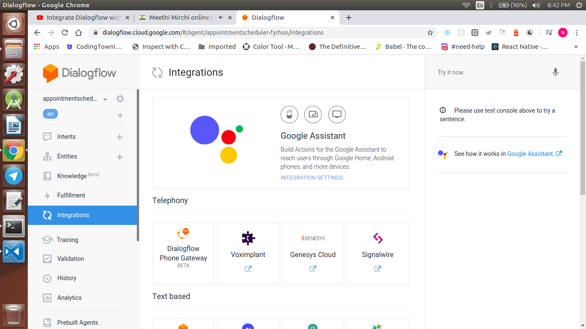
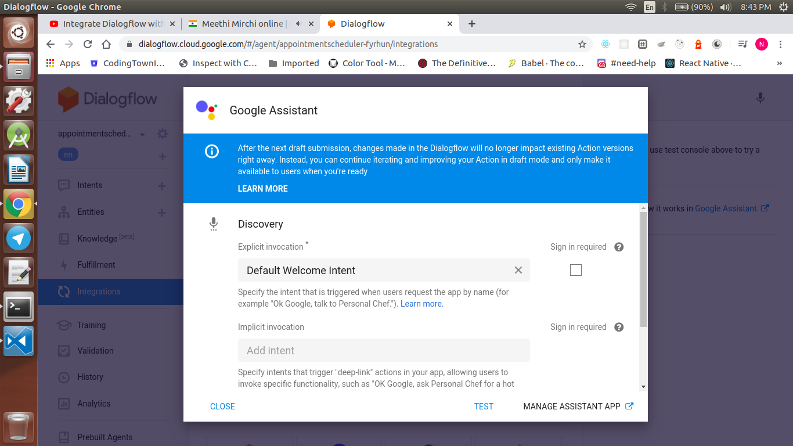
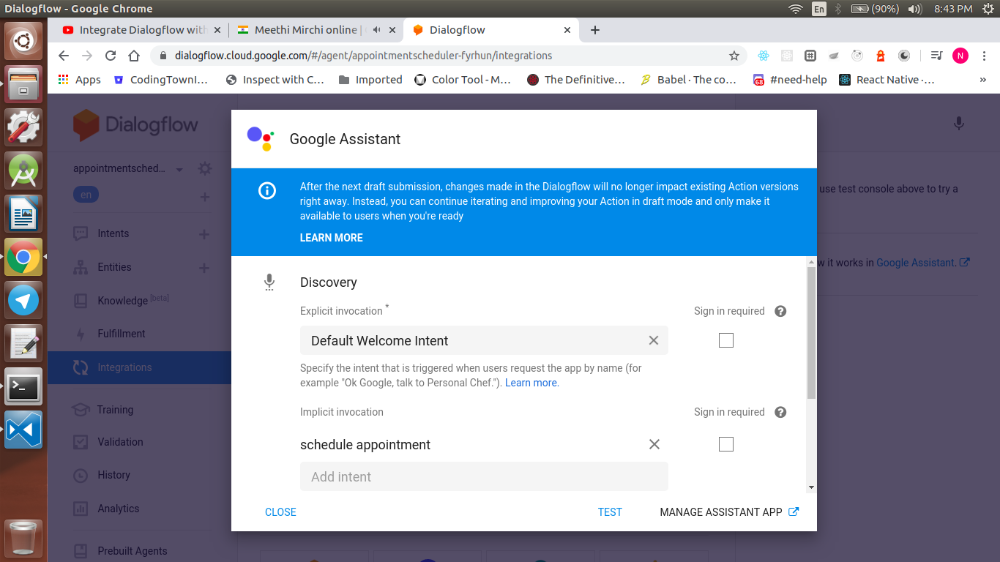

<div align="center">
  <h1>Actions on Google - Day 23</h1>
  <p>Deconstructing Chatbots - Part 3</p>
</div>

# Integrating dialogflow to Actions on Google

To integrate the dialogflow with Actions on Google click `Integrations` on the left hand side

<div align="center">
  
</div>


Now you could see an option named `Integration Settings` for Google Assistant, Click that you could see an Pop-up window like below image

Now in the window you can notice 2 things 

### Explicit Invocation

* Explicit Invocation - Once your action is triggered which intent should be called

<div align="center">
  
</div>

Explicit Invocation example : `Hey Google talk to appointment scheduler`


### Implicit Invocation

* Implicit Invocation - If the user directly calls an intent

<div align="center">
  
</div>

Implicit Invocation example : `Hey Google ask appointment scheduler to book an appointment on next friday at 3`


# Integrating Dialogflow with Telephony Gateway

If you want your action to be available as a phone call you can use the Telephony Gateway option.

As on Mar 23, 2020 4 telephony services are available like below

1. Dialogflow Phone Gateway (Beta version) - Not available for India
2. Voximplant - [Click here to view the demo](https://youtu.be/SfynpK6YZ6o)
3. Genesys cloud - [Click here to view the demo](https://player.vimeo.com/video/385308730)
4. Signal Wire - [Click here to view the website](https://signalwire.com/pricing/voice)

# Dialogflow Entities

Extracting useful info from the user 

3 types of Entities

* System Entities
* Developer Entities
* Session Entities

### System Entities

System generated entities to extract information from user voice

```
@sys.date
@sys.time
@sys.datetime
@sys.geo-country-code
@sys.age
@sys.ordinal
@sys.url
@sys.any
@sys.music-artist
@sys.unit-weight
@sys.cardinal
@sys.unit-weight-name
@sys.airport
@sys.unit-information-name
@sys.phone-number
@sys.music-genre
@sys.number-sequence
@sys.number
@sys.zip-code
@sys.given_name
@sys.last_name
@sys.unit-speed-name
@sys.address
@sys.unit-length
@sys.location
@sys.person
@sys.number-integer
@sys.temperature
@sys.geo-country
@sys.unit-information
@sys.geo-capital
@sys.geo-state
@sys.percentage
@sys.unit-area
@sys.email
@sys.place-attraction
@sys.unit-volume
@sys.currency_name
@sys.color
@sys.language
@sys.unit-currency
@sys.time-period
@sys.geo-city
@sys.date-period
@sys.duration
@sys.date
@sys.unit-area-name
@sys.flight-number
@sys.unit-length-name
@sys.unit-volume-name
@sys.unit-speed
```

### Developer Entities

Entities created by the developer

### Session Entities

Entities which will be available for the Session Id


# Reference Links

* Introduction - [Click here to view](https://youtu.be/O00K10xP5MU?list=PLIivdWyY5sqK5SM34zbkitWLOV-b3V40B)
* Dialogflow Components - [Click here to view](https://youtu.be/Ov3CDTxZRQc?list=PLIivdWyY5sqK5SM34zbkitWLOV-b3V40B)
* Appointment Scheduler - [Click here to view](https://youtu.be/oU88sHd6ilE?list=PLIivdWyY5sqK5SM34zbkitWLOV-b3V40B)
* Integrating Dialogflow with Actions on Google - [Click here to view](https://youtu.be/z5f52sMgJLQ?list=PLIivdWyY5sqK5SM34zbkitWLOV-b3V40B)
* Dialogflow Telephony - [Click here to view](https://youtu.be/whZPw0HFnTE?list=PLIivdWyY5sqK5SM34zbkitWLOV-b3V40B)
* Entities - [Click here to view](https://youtu.be/UmMRW3kG738?list=PLIivdWyY5sqK5SM34zbkitWLOV-b3V40B)

