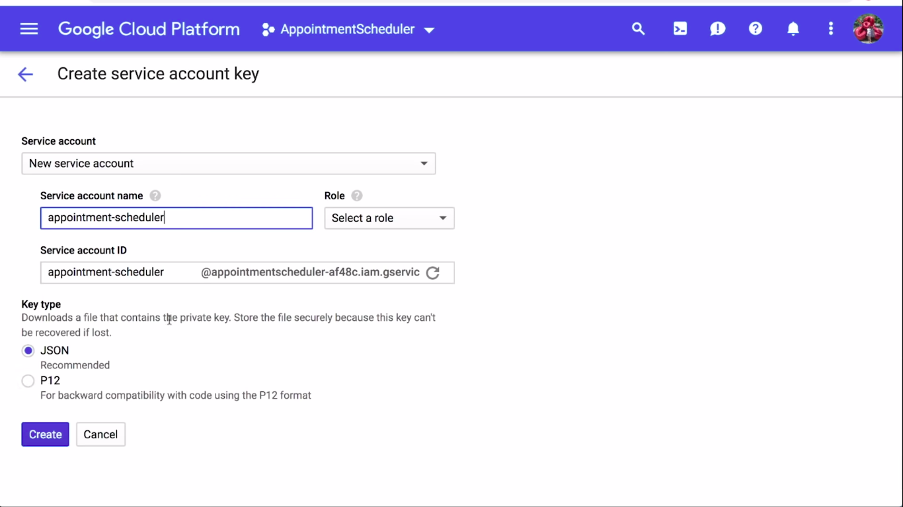

  <h1>Actions on Google - Day 24</h1>
  
Deconstructing Chatbots - Part 4

# Integrating Dialogflow with Twilio Messaging service

We can integrate our dialogflow service with Twilio messaging service by creating an account in Twilio dashboard and then complete all the form filling.

  

Once the form filling is completed you can start using the messaging service

Twilio link: [Click here to view](https://www.twilio.com/)

# Integrate Dialogflow with Google Calendar

We can create an event in Google Calendar using dialogflow

Dialogflow making call to external api using Dialogflow fulfilment

  

Fulfilment can be called for each intents based on our need

  

How the fulfilement is got called? It is done based on the data extraction

  

Overall flow on Appointment scheduler integrating with Google Calendar

  

Getting the project id from Dialogflow Settings

  

Creating Service account key for the Appointment scheduler action in GCP

  

Creating an event in Google Calendar by pasting the client email which we got while creating the service account file

  

Google Calendar webhook [Github link](https://github.com/priyankavergadia/AppointmentScheduler-GoogleCalendar)

# Reference Links

* Introduction - [Click here to view](https://youtu.be/O00K10xP5MU?list=PLIivdWyY5sqK5SM34zbkitWLOV-b3V40B)
* Dialogflow Components - [Click here to view](https://youtu.be/Ov3CDTxZRQc?list=PLIivdWyY5sqK5SM34zbkitWLOV-b3V40B)
* Appointment Scheduler - [Click here to view](https://youtu.be/oU88sHd6ilE?list=PLIivdWyY5sqK5SM34zbkitWLOV-b3V40B)
* Integrating Dialogflow with Actions on Google - [Click here to view](https://youtu.be/z5f52sMgJLQ?list=PLIivdWyY5sqK5SM34zbkitWLOV-b3V40B)
* Dialogflow Telephony - [Click here to view](https://youtu.be/whZPw0HFnTE?list=PLIivdWyY5sqK5SM34zbkitWLOV-b3V40B)
* Entities - [Click here to view](https://youtu.be/UmMRW3kG738?list=PLIivdWyY5sqK5SM34zbkitWLOV-b3V40B)
* Dialogflow Twilio Integration [Click here to view](https://youtu.be/t6ecd3Hi_hY?list=PLIivdWyY5sqK5SM34zbkitWLOV-b3V40B)
* Integrating Dialogflow with Google Calendar [Click here to view](https://youtu.be/4_MvIf_ULgc?list=PLIivdWyY5sqK5SM34zbkitWLOV-b3V40B)