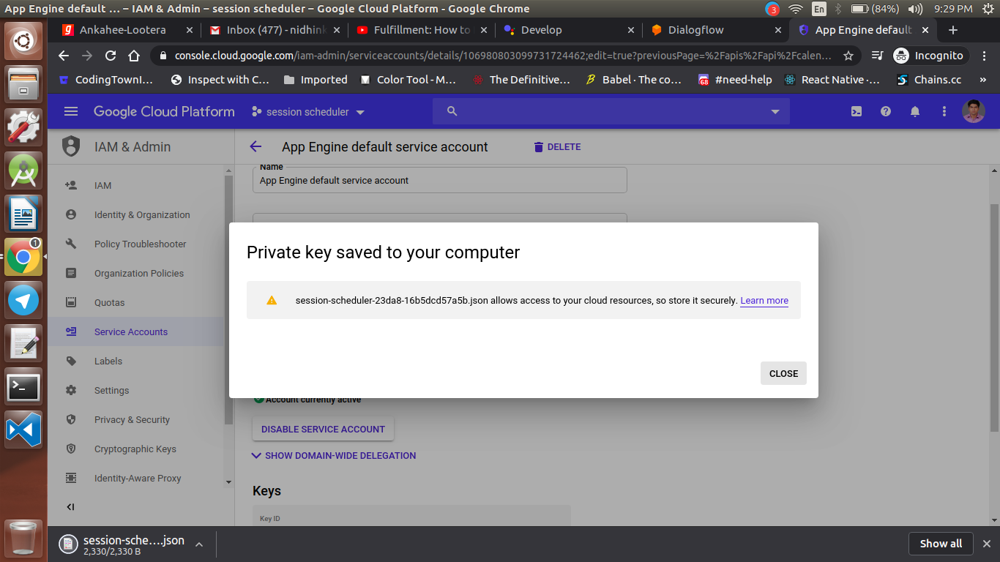
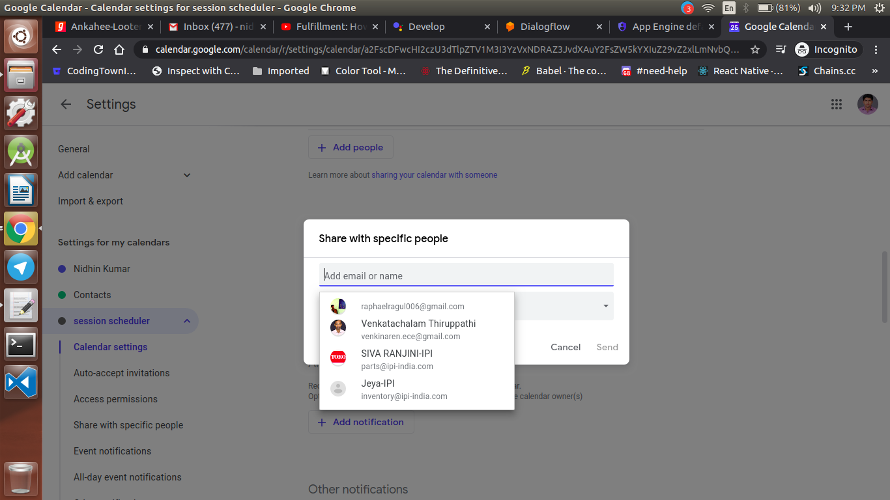

  <h1>Actions on Google - Day 25</h1>
  
PoC - Session Scheduler with Google Calendar - Part 2

We will create an Session Scheduler action by creating an event in Google Calendar

Create an new Actions on Google project like below

  

Once the project is selected click `Conversational` and then click Invocation name and give the invocation name for your action

  

Once the invocation name is created click `Actions` and then select `Get Started` which will navigate to Dialogflow

  

  

Once the screen in navigated to dialogflow check whether the agent name is same as your action name

  

Click `Create` and Click `Intents` and select a new intent named `Schedule event` and in the training phrase add like the below image

  

Once you add the `Training phrase` you could see some highlighters for the training data which are the `system entities`

Once it is done scroll down click `Action and Parameters` and check all the `system entities` and add the prompts for it

  

  

Prompt is used to check whether the user has given the correct phrase or not

Once the `Actions and parameters` are created scroll down to the Default Response and add the response like the below image

  

Click `Save` for the intent and goto the Dialogflow settings you can see a option called `Google Cloud` click on it which will navigate to GCP console

  

Now click on APIS and Services and select `Calendar API`

  

Click the `Calendar API` and enable the API

  

Once the API is created click on the `Create new Credential`

  

Now give the appname and description and select the service account type as `JSON` and select `Create a new key`

  

  

Once the JSON file is created  go to  `Google Calendar` and create a new calendar named `Session Scheduler`

  

Fill the name and description as well as select the timezone and click save

  

Once the Calendar is created click the `Settings option` and in `Add people section` paste the `client_email` from the `service-account.json` which you have downloaded earlier

  

Now we have completed the setup of Google Calendar and Dialogflow.We will see how to create cloud functions for the Session scheduler action on `Day 26`