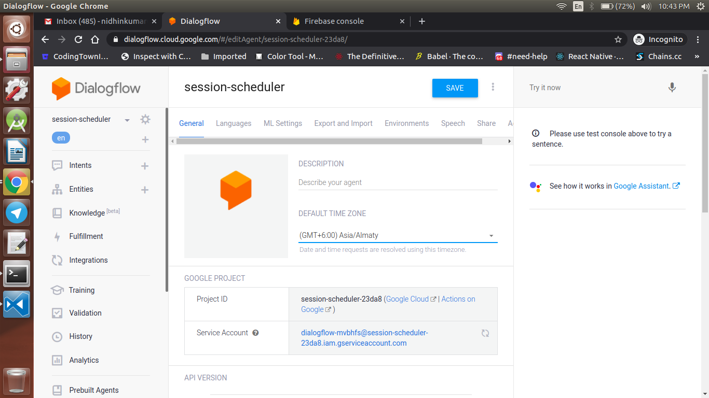
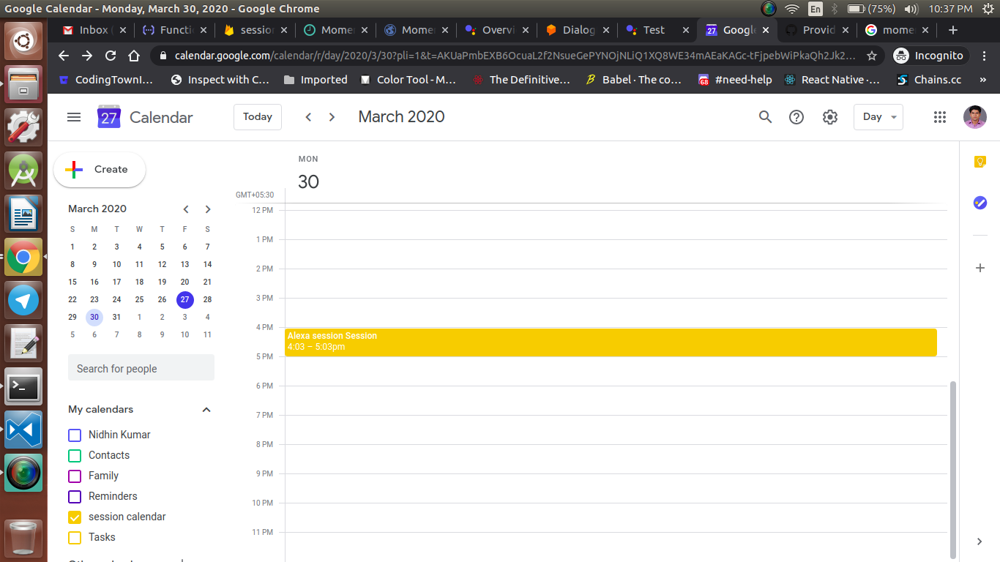

<div align="center">
  <h1>Actions on Google - Day 27</h1>
  <p>PoC - Session Scheduler with Google Calendar - Part 3</p>
</div>

After deploying the code which we have done on `Day 26` we found some bugs that the event was not created in Google Calendar

So we looked into the Root cause for the problem and found the causes using the logs from firebase cloud functions logs

<div align="center">
  
</div>

### Root Causes

* Timezone was set different in cloud function and in Dialogflow, Calendar
* The date which is received is converted as invalid date
* Since the date was invalid event was not created


#### Issue 1

Will fix the different timezones

In Dialogflow the default timezone was selected as `+06.00` instead of `+05.30`

<div align="center">
  
</div>

Which has been converted to `(GMT +05.30 Asia/Kolkata)` and then in Google Calendar the timezone is converted to `Asia/Kolkata`

Once that part is completed it is time to change it in the cloud functions

```
 const timeZone = 'Pacific/Los_Angeles';
 const timeZoneOffset = '-07:00';
```

Instead of `U.S.` timings change it to `IST` like below

```
 const timeZone = 'Asia/Kolkata';
 const timeZoneOffset = '+05:30';
```

Now the first issue is completed

#### Issue 2

Now we will fix the invalid date option in cloud function, even though the date is received as params it is not converted as per the format. Instead it shows an `Invalid Date`

Existing Code

```
const dateTimeStart = new Date(Date.parse(agent.parameters.date.split('T')[0] + 'T' + agent.parameters.time.split('T')[1].split('-')[0] + timeZoneOffset));
const dateTimeEnd = new Date(new Date(dateTimeStart).setHours(dateTimeStart.getHours() + 1));
```

First to check whether these guys are causing the problem we have given an hardcoded date like below to check

```
const dateTimeStart = '2020-03-30T03:30:00+05:30';
const dateTimeEnd = '2020-03-30T04:30:00+05:30';
```

Now we have deployed the code and checked whether we are able to create an event in calendar

# Boom !!! the event has been created

So the root cause is the date so we planned to use `moment` and `moment-timezone` so i have installed the following plugins

* `npm i moment`
* `npm i moment-timezone`


Once the plugins are installed import the plugins like below

```
const moment = require('moment-timezone');
const Moment = require('moment');
```

Now it is the time to fix the `dateTimeStart` and `dateTimeEnd`

```
const startDate = moment.tz(agent.parameters.date, timeZone).format('YYYY-MM-DD');
const startTime = moment.tz(agent.parameters.time, timeZone).format('HH:MM');

const dateTimeStart = moment.tz(startDate + "T" + startTime, timeZone).format();
const dateTimeEnd = Moment(dateTimeStart).add(1, 'hours').format();
```

So what we have done in the above code is we have splitted the date from `agent.parameters.date` and time from `agent.parameter.time` and stored them in a seperate const variable named `startDate` and `startTime`

Once it is done now we combined both the `startDate` and `startTime` like below

```
const dateTimeStart = moment.tz(startDate + "T" + startTime, timeZone).format();
```

Now we have got the `dateTimeStart` now it is the time to create the `dateTimeEnd` which is very simple all you need to do is add `1 hour` from the `startTime` like below using `moment`

```
const dateTimeEnd = Moment(dateTimeStart).add(1, 'hours').format();
```

Once it is done you can deploy the code and see whether everything works as expected or not

# OOh No why it is not working

Now it has created a new bug if you look at the logs you can see the date is formatted correctly but the event is not created


If you see the code you can notice something like this

```
 calendar.events.list({
    auth: serviceAccountAuth, // List events for time period
    calendarId: calendarId,
    timeMin: dateTimeStart.toISOString(),
    timeMax: dateTimeEnd.toISOString()
 },
```

In the calendar list event the `dateTimeStart` and `dateTimeEnd` is converted to `toISOString()` which is not needed in our case since we are using moment

So if we remove the `toISOString()` like below


```
calendar.events.list({
    auth: serviceAccountAuth, // List events for time period
    calendarId: calendarId,
    timeMin: dateTimeStart,
    timeMax: dateTimeEnd
 },
```

Now if you deploy your code you can see the event is creted like below 

<div align="center">
  
</div>
 

 ## Demo

 [Click here to view the demo](https://firebasestorage.googleapis.com/v0/b/momtemplates.appspot.com/o/datetime-output-2020-03-27_22.35.34.mp4?alt=media&token=6accb953-4b90-404f-89c4-e30f9ca1118e)