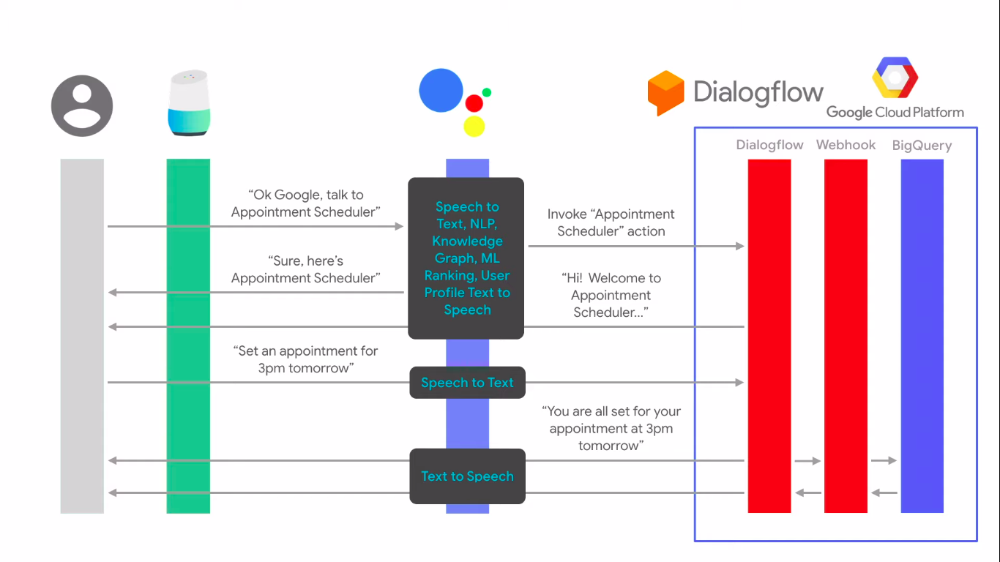
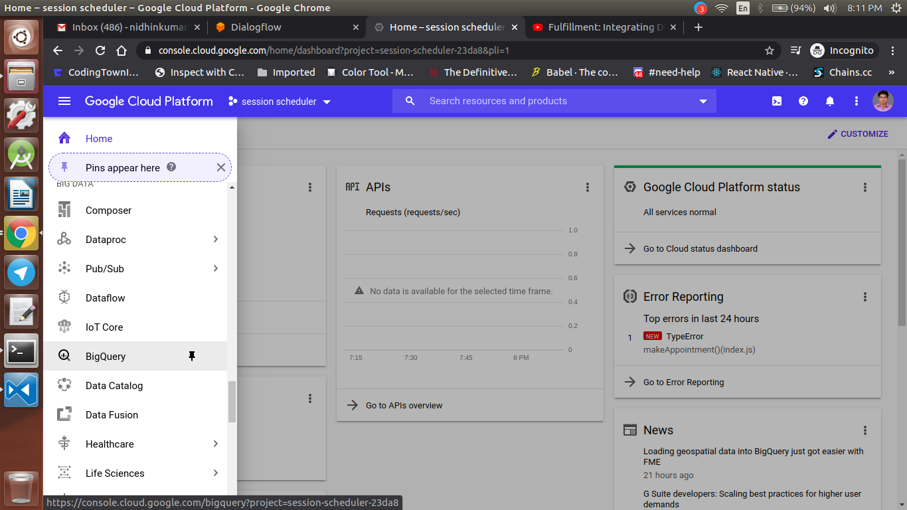
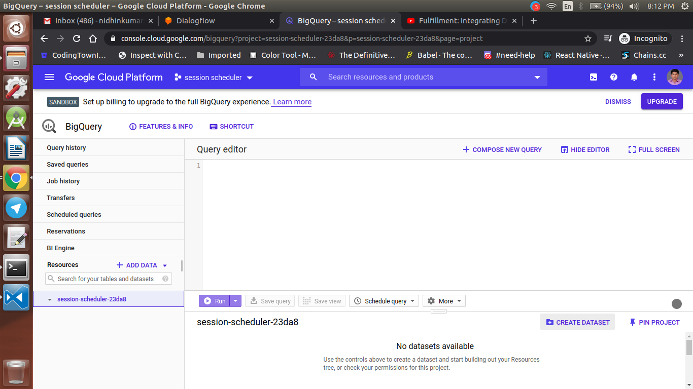
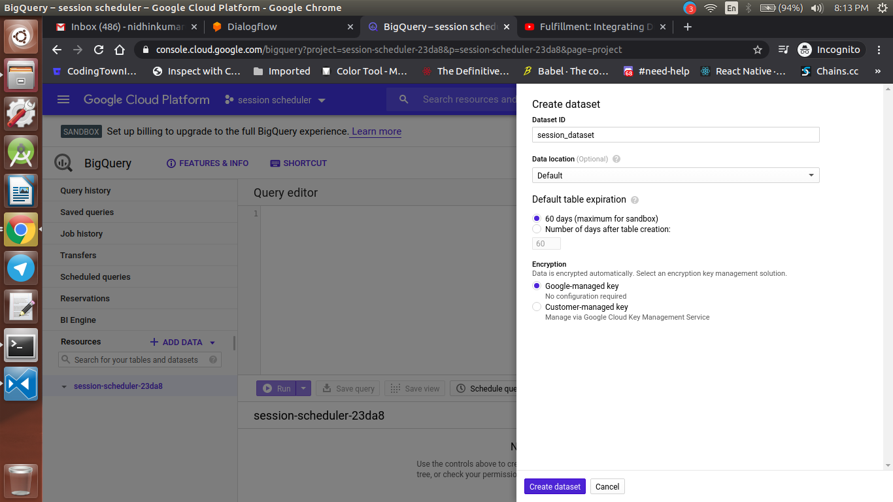
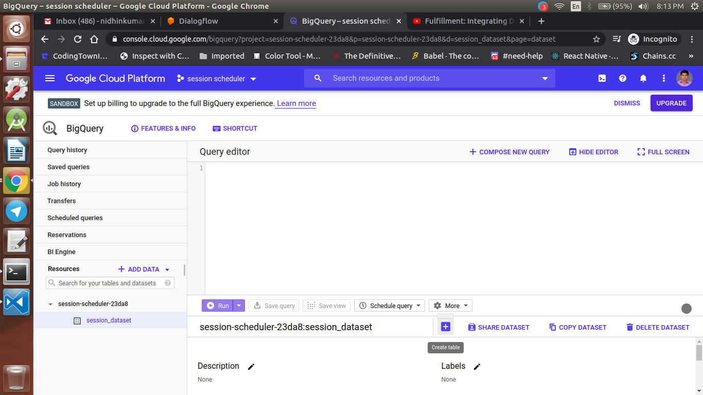
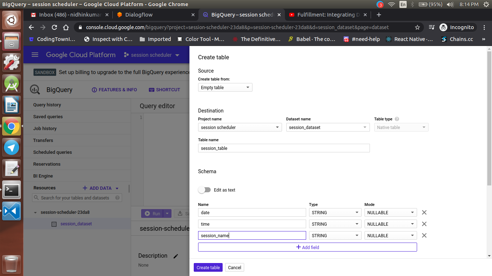

<div align="center">
  <h1>Actions on Google - Day 28</h1>
  <p>PoC - Session Scheduler with BigQuery - Part 4</p>
</div>


# Integrating Dialogflow agent with BigQuery

<div align="center">
  
</div>

Now what we will do is we will store the user queries from session scheduler to BigQuery

For that we need to do the below steps

1. Create Tables for the session scheduler in BigQuery
2. Integrate the BigQuery in cloud functions


## Creating Table in BigQuery

Now we will create an `Dataset`, `Table` and add `Schema` for the table step by step

Go to your `Google Cloud Console` and select the `project` in my case it is `scheduler_333`

Once you selected your project On the Left hand side click the `hamburger` icon like the below image and select `Big Query`

<div align="center">
  
</div>

Once the BigQuery is select the `Project Id` and click `Create Dataset`

<div align="center">
  
</div>

Once you click `Create Dataset` give the `Dataset Id` like below

<div align="center">
  
</div>

Once you give the dataset name click `Create dataset`

Once the `Dataset` is created select that `Dataset` on the right hand side you could see an option `Create Table` click on it

<div align="center">
  
</div>

Once the `Create Table` is opened give the `Table Name` as well as the schemas like below

<div align="center">
  
</div>

Now click `Create Table`


Now we will add some logics in the cloud functions which we have created earlier

First install the BigQuery plugin like below

`npm i @google-cloud/bigquery`

Once the plugin is installed go to `index.js` file and import the BigQuery like below

```
const BIGQUERY = require('@google-cloud/bigquery');
```

Once the import is completed go to the 

```
 return createCalendarEvent(dateTimeStart, dateTimeEnd, session_name).then(() => {
    agent.add(`Ok, let me see if we can fit you in. ${appointmentTimeString} is fine!.`);
    addToBigQuery(agent, appointment_type);
  }).catch(() => {
    agent.add(`I'm sorry, there are no slots available for ${appointmentTimeString}.`);
  });
```

add the `addToBigQuery(agent, appointment_type)` and now create the `addToBigQuery()` and add the below code

```
function addToBigQuery(agent, appointment_type) {
  console.log('addToBigQuery got called', agent);
  const date_bq = moment.tz(agent.parameters.date, timeZone).format('YYYY-MM-DD');
  const time_bq = moment.tz(agent.parameters.time, timeZone).format('HH:mm');

  /**
  * TODO(developer): Uncomment the following lines before running the sample.
  */
  const projectId = 'session-scheduler-23da8'; 
  const datasetId = "session_dataset";
  const tableId = "session_table";
  const bigquery = new BIGQUERY({
    projectId: projectId
  });
  const rows = [{ date: date_bq, time: time_bq, session_name: appointment_type }];

  bigquery
    .dataset(datasetId)
    .table(tableId)
    .insert(rows)
    .then(() => {
      console.log(`Inserted ${rows.length} rows`);
    })
    .catch(err => {
      if (err && err.name === 'PartialFailureError') {
        if (err.errors && err.errors.length > 0) {
          console.log('Insert errors:');
          err.errors.forEach(err => console.error(err));
        }
      } else {
        console.error('ERROR:', err);
      }
    });
  agent.add(`Added ${date_bq} and ${time_bq} into the table`);
}
```

Now deploy your code using the command `firebase deploy` and create an event and check whether the created event details are available in BigQuery

For me the event is getting created but the data is not inserted into BigQuery