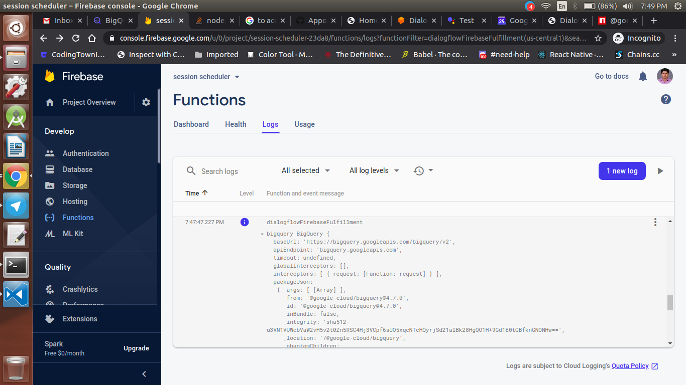
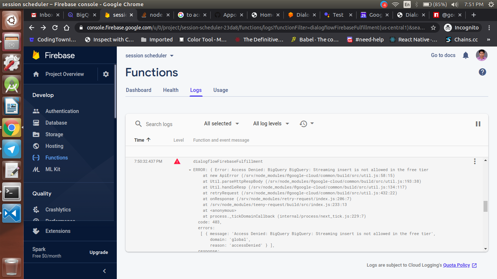

<div align="center">
  <h1>Actions on Google - Day 29</h1>
  <p>PoC - Session Scheduler with BigQuery - Part 5</p>
</div>

On `Day28` after deploying the cloud function the tested the action in simulator where both the success and failure block gets called as well as the event gots created in calendar whereas in BigQuery the data was not created

So i tried to debug the problem today and tried to found the RootCause

AS usual took the baby steps to find the root cause

### Baby Steps:

  1. Tried to move the bigquery function in success block and check whether it works or not, but as usual it fails
  2. Then tried to hide the below logics and tried to run

  ```
      const projectId = 'session-scheduler-23da8'; 
      const datasetId = 'session_dataset';
      const tableId = 'session_table';
      const rows = [{ date: startDate, time: startTime, type: session_name }];

      const bigquery = new BIGQUERY({
        projectId: projectId
      });
      console.log('bigquery', BIGQUERY);
        // bigquery
        //     .dataset(datasetId)
        //     .table(tableId)
        //     .insert(rows)
        //     .then(() => {
        //     console.log(`Inserted ${rows.length} rows`);
        //     })
        //     .catch(err => {
        //     if (err && err.name === 'PartialFailureError') {
        //         if (err.errors && err.errors.length > 0) {
        //         console.log('Insert errors:');
        //         err.errors.forEach(err => console.error(err));
        //         }
        //     } else {
        //         console.error('ERROR:', err);
        //     }
        //     });
  ```

  But still the error persist so decided to hide the entire BIGQUERY stuffs and deployed the application and it works normally

 3. Uncommented the codes and tried to give a hardcode value for the rows but it didn't works
 4. Checked whether the package was installed correctly or not it was installed correctly.
 5. Checked the plugin documentation everything looks normal
 6. So tried to reinstall the plugin again and checked as usual it didn't works
 7. Thought it would be some billing issues in GCP so tried to create an GCP account in `Qwiklabs` and created a `BigQuery Datasets, table and schemas` and tried again did not works
 8. Compared the codes written by `Priyanka` mam everything seems to be normal
 9. Compared the `package.json` files had different versions of `@google-cloud/bigquery`
     
    My `package.json`

    ```
    "dependencies": {
        "@google-cloud/bigquery": "^4.7.0",
        .....
    },
    ```

    Priyanka mam `package.json` file

    ```
     "dependencies": {
       "@google-cloud/bigquery": "^0.12.0"
     }
    ```
     
  10. Looked at the documentation provided by `@google-cloud/bigquery` plugin saw how the import statement is used
  11. Compared the `import` statement provided by `@google-cloud/bigquery` and `Priyanka` mam seems to be different

  @google-cloud/bigquery `import statement`

  ```
  const { BigQuery } = require('@google-cloud/bigquery');
  ```

  Priyanka mam `import statement`

  ```
  const BIGQUERY = require('@google-cloud/bigquery');
  ```

12. Tried import statement like `@google-cloud/bigquery` 

# Boom !

Log prints for BigQuery `pulse` got started to work for `BigQuery`

<div align="center">
  
</div>

Tried to uncomment the `BigQuery` codes and deployed the codes and tested the actions

Now the dual response from success and failure block has been restricted and only success block response came

Looked at `BigQuery` to see whether the table has got any new rows

## Unfortunately

No records was created

Checked the logs and found the below error

<div align="center">
  
</div>

Looked deep into the logs found that

```
Streaming error is not allowed in the free-tier 
```

Need to check whether it will works in `Qwiklabs` on `Day 30`

# Questions

Within a year does the `@google-cloud/bigquery` has updated from `^0.12.0` to `^4.7.0`
