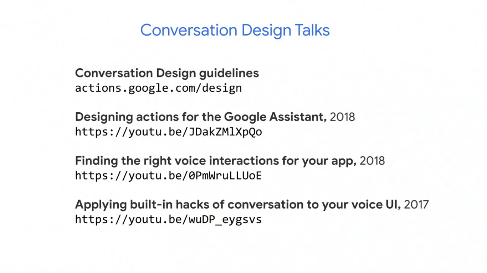

  <h1>Actions on Google - Day 3</h1>
  
How to build actions for smart displays

# Overview
* Voice experience is the foundation
* Use dialogue to guide the user
* Use rich response to augment the voice experience
* Use Interactive canvas for games

   

Different set of surface where Google Asistant works

   

Grouping of surfaces

   

# Voice experience is the foundation

Let's have a look at the pet adoption flow

   

If you see the below image on how the default welcome intent was called at first

   

If you see the response you could see something as `we` which denotes whom ? as well as at the bottom `pls tell me your name` which no user will give at the first pace itself.

Let's see how it is changed

   

Here instead of directly asking the user name we have asking the user whether the user is interested to adopt a pet or not?

# Use Dialogue to guide the user

If you look at the below dialogue you could see we have asked everthing in a single stretch

   

If you see the below one you could see we have done 2 things we have asked whether the user is able to feed the hamster as well as to exercise the hamster

   

Creating a complete voice experience

   

# Use rich response to augment the voice experience

Will see some the rich response which can be added to the action. If you see the below flows

   

   

We would use some rich response to showcase the users what they can feed the hamster and which exercise they can do for their hamster using some of the responses like

* Carousel
* Suggestion Chips
* List
* Media response

# Use Interactive canvas for games

Using interactive canvas we can create a rich set of animations, displays using HTML, CSS and JavaScript

   

The interactive canvas is available only for *games category

## What about mobile ?

Suppose if the user is invoked your action in a smart speaker and that particular action has some images to be displayed out. It can be done if the user has any screen output like the below image

   

## Tools

* Use Storyboard (Using a pen and a paper create stories)
* UI Toolkit (How the image will be shown in smaller mobile screens and bigger screens)
* Actions simulator (Use actions simulator to test your action in different surfaces)

## Resource Links

   

   

