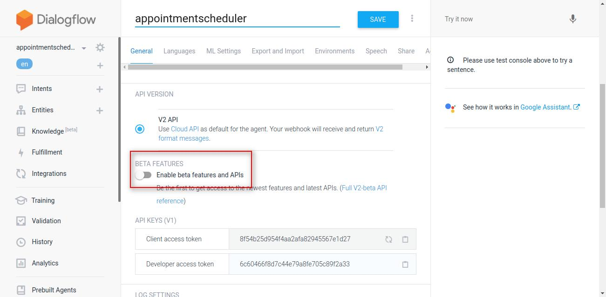
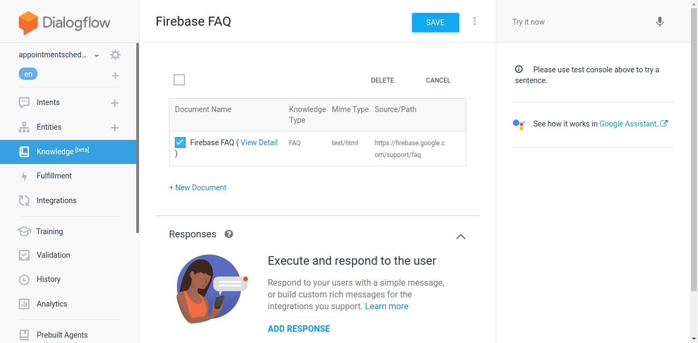
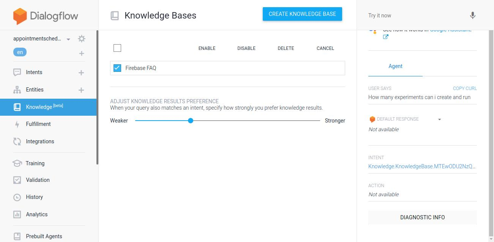
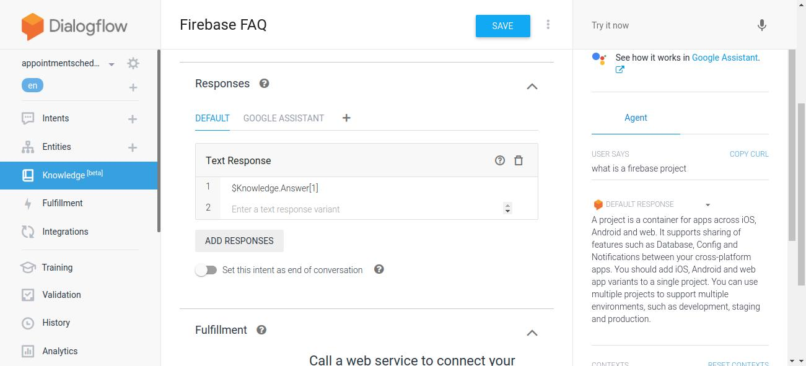
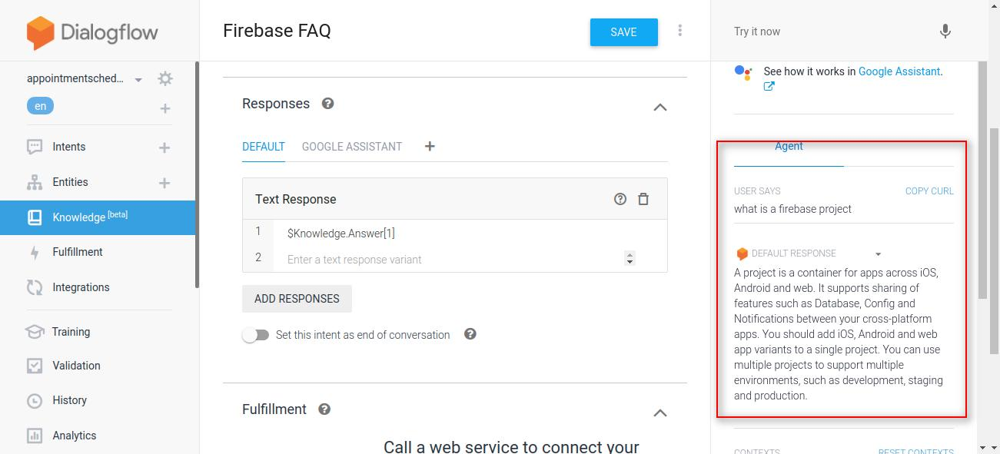

  <h1>Actions on Google - Day 30</h1>
  
Deconstructing Chatbots - Part 5

# Create FAQ Chatbot with Dialogflow

To create a FAQ Chatbot open dialogflow cosole and create a new agent like below

  

Once the agent is created click `Knowledge` and open settings and enable `Beta` like the below image

  

  

Once the Beta version is enabled go the `Knowledge` and click create the first one

  

Once the Knowledge is created it will ask to add the knowledge document

  

Now it will take some time to save the data.Once the FAQ is saved check the box like below

  

Once it is enabled enable the Knowledgebase like below and click `Enable`

  

Now for the response enable the response like below

  

Now if you test the action you can see the output like below

  

