

  <h1>Actions on Google - Day 4</h1>
  
Smart Home - 101 - How to develop connected home

# Smart Home

Every smart device which are connected in the google home. Evolution of computing from pc, web, mobile to ambient computing

   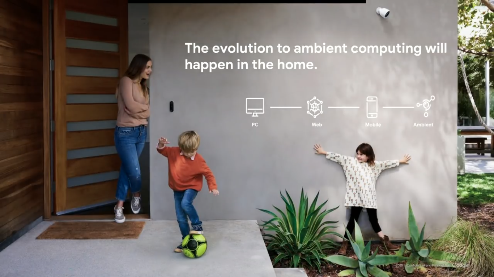

We will have a home graph where we can see what are all the devices that are available in each room as well as from which room a request is been called

   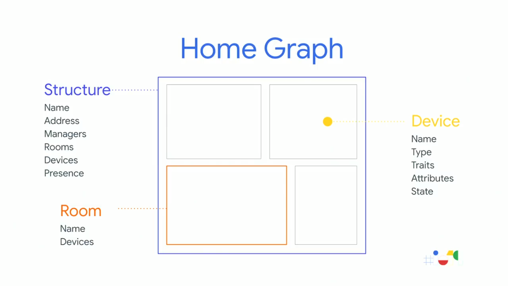

Google smart Home platform

   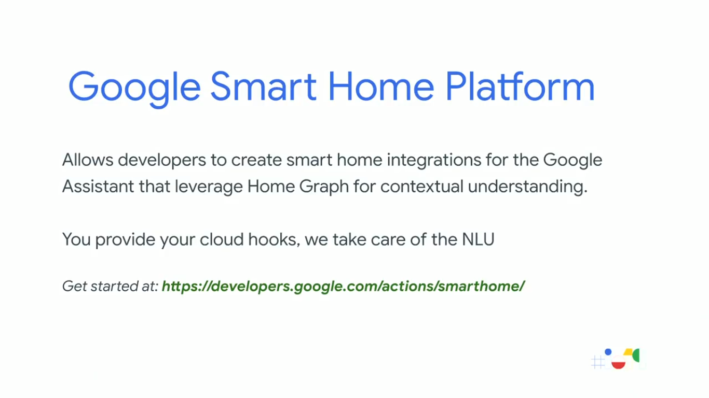

Intelligent example if the car gargage is not closed you can close it from your bedroom using your voice as well as the security, energy management

   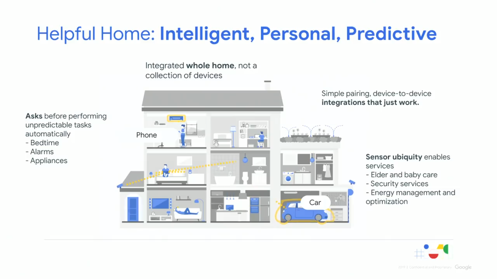

Smart Home api

   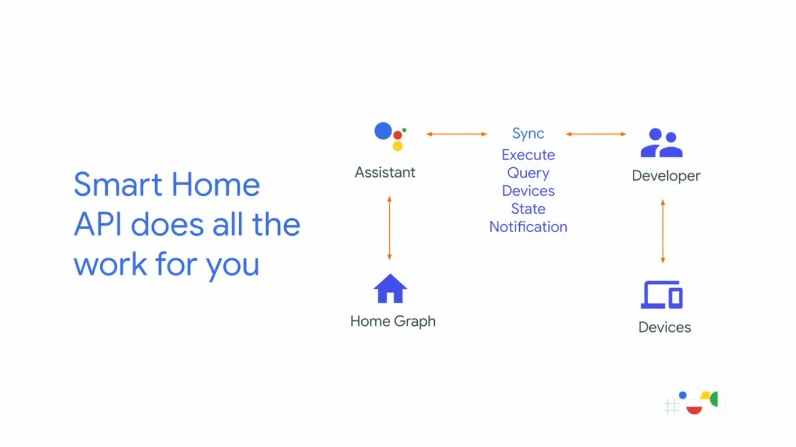

List of devices available from 2016 - 2019

   

Smart Home brands

   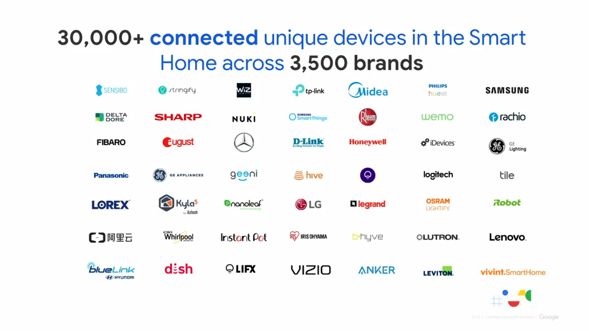

# Basic Smart Home

If you want to create actions for the Smart Home you can do it using the API's provided for home where you can get the device details and pass it in the request like below

   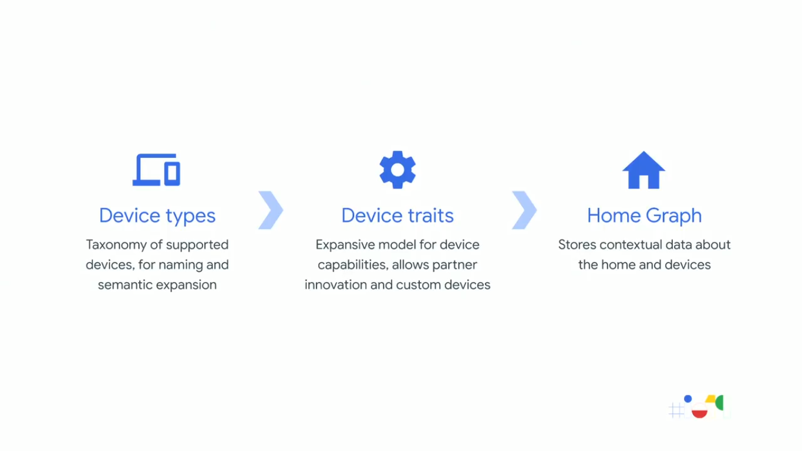

Here the devices types will have details like whether it is vacum cleaner, thermostat and then in the device traits you will have more details

   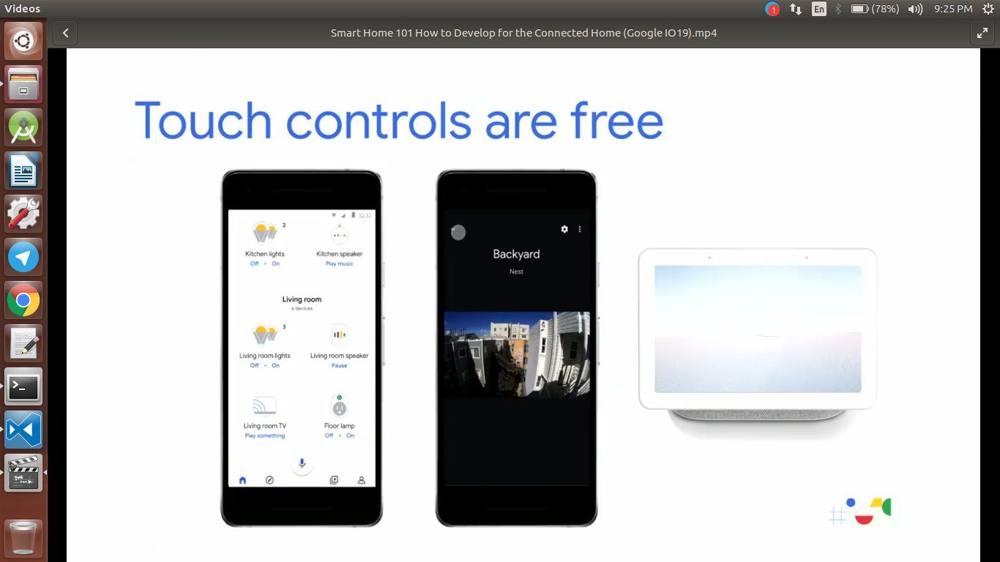

Instead of giving voice commands you can give the commands by touch.Even  you can get the report state for example if you lock a door and if the door is locked it should be shown in the view else the user would feel that the door is not locked which is not a good practice

   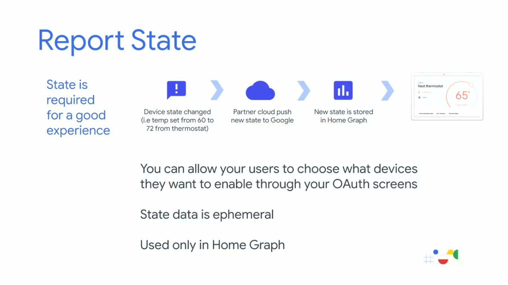

Smart Home verticals we have narrowed the categories like below

   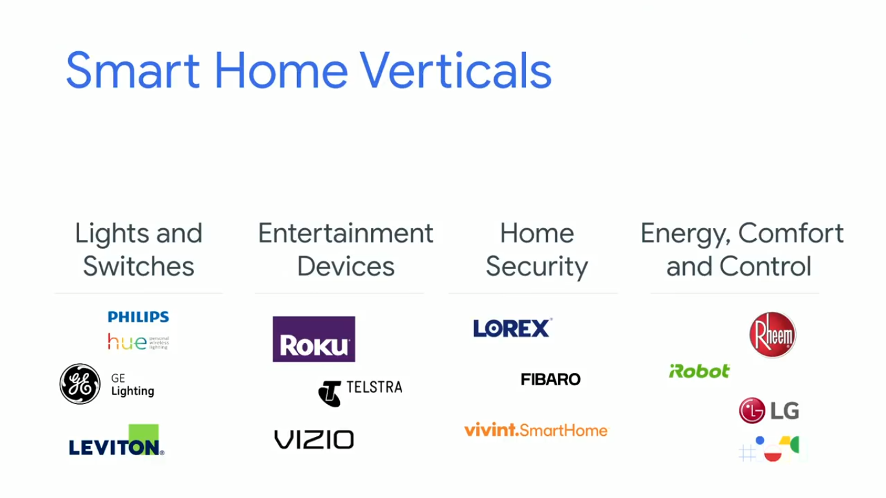

There is two way we can integrate it like below

   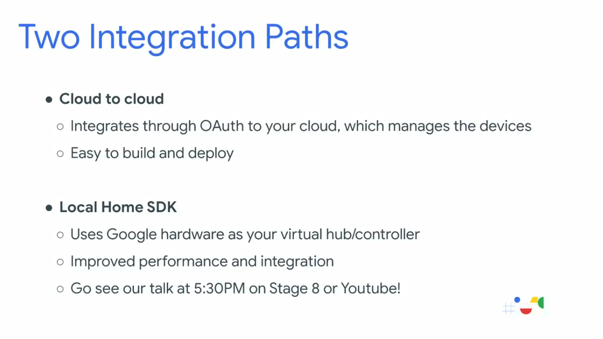

If you want to publish it there are some milestones that needs to be completed like below

   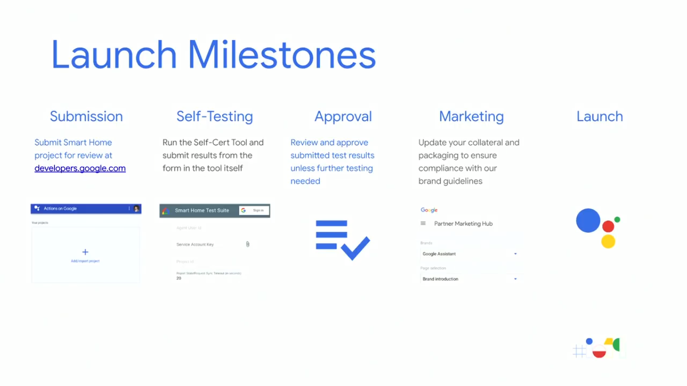

Smart Home growth

   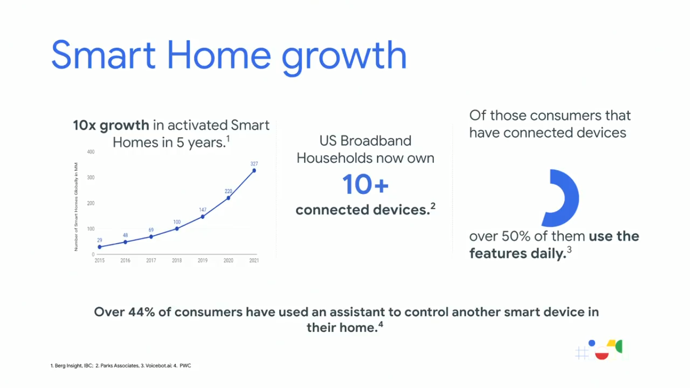

Links

   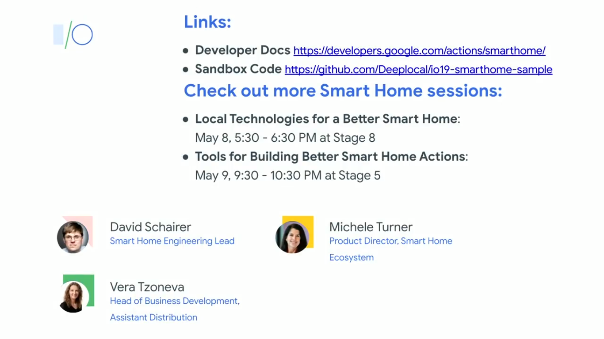

Best Practices

   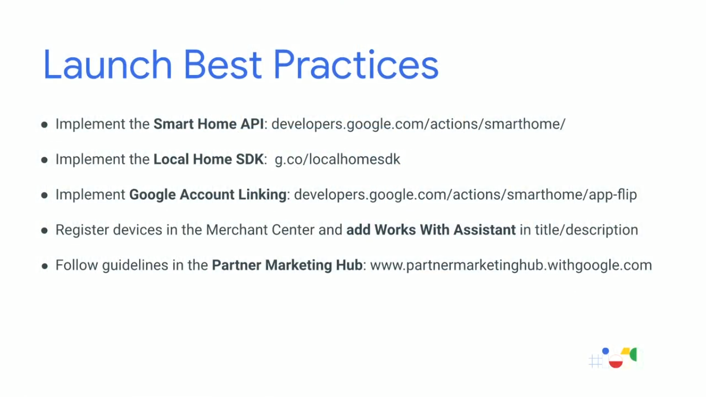

