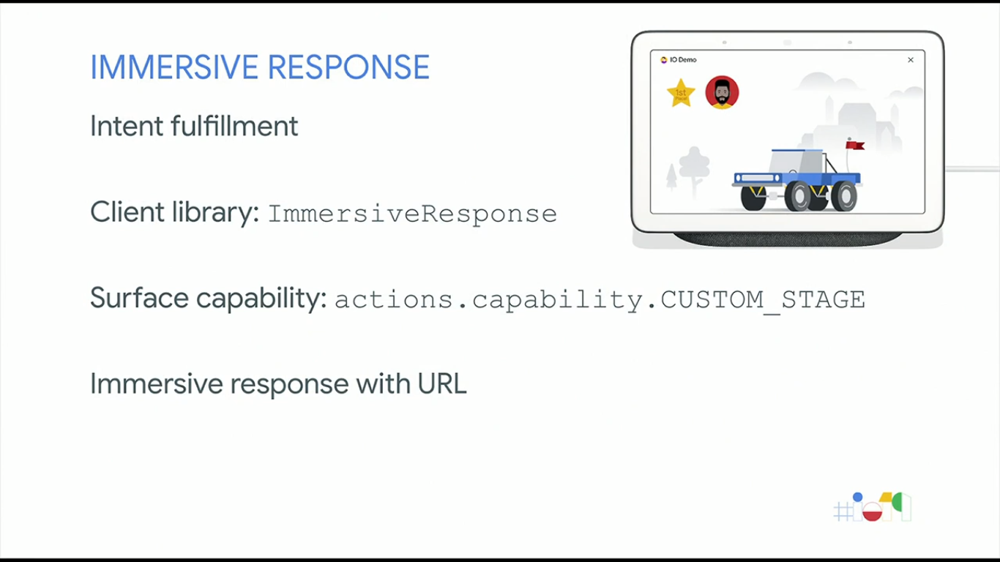

  <h1>Actions on Google - Day 5</h1>
  
Build Google Assistant for Interactive Canvas

# Interactive Canvas

A new set of tools that allows developers to create interactive response using google assistant

   

For creating visual games google assistant used interactive canvas

   

Adoption of screen display

   

Technical Overview

   

Interactive actions

   

### Creating an Interactive Games

Right now interactive action is available only for games.Go to Google assistant and create a project and select Games and Fun category

   

Once selected select conversational

   

Once selected scroll go to enable interactive canvas

   

Click add action like below

   

Click the intents and select

   

Open the play intent you can see the events like below

   

Conversational Interactive Action

   

We will be using immersive response for the interactive canvas

   

In javascript we will add the immersive response like below

   

To add the canvas style we would use the following

   

Implement the canvas api like below

   

Once added your canvas will be ready like

   

Triggering events - to trigger and event

   

Syncing the audio with the visual 

   

We will use the SSML mark tag 

   

If you are using interactive canvas for mobile and web pls look at the below design

   

# Debugging Interactive Canvas

To debug the interactive canvas there are ways like below

* Simulator(iframe)
* On device
* Debug Overlay
* FPS Stats

# Best Practices

* Platform advantages

   

* Design for surface

   

* Voice forward

   

* Leverage visuals

   

* Handle errors

   

* Optimized Displays

   

# Resources

Interactive Canvas Resources

   

