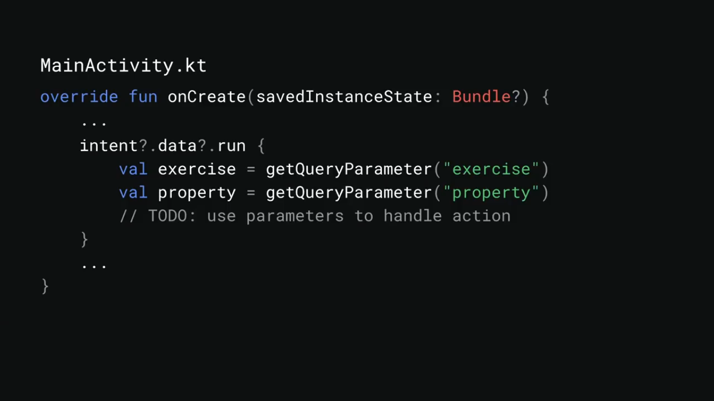

  <h1>Actions on Google - Day 7</h1>
  
Extend your Android App to the Google Assistant

# Intro to App Actions

If you want to open your mobile app through voice you can do it using Google Assistant

Why you need to extend your app

Instead of making the user to scroll to find the application, we can use the voice to open the application.
Even we can pass the data from voice to mobile app

   

   

### Step 1 Android Deep Links

   

What is App Actions

   

### Step 2 Tell the assistant how to your action

   

Editmanifest.xml

   

Actions.xml

   

UriTemplate

   

   

   

### Step 3 Optimize your app for the assistant

Log results using Firebase

   

Setup Firebase

   

Handling search intent

   

Implement Assistant Api

   

### Step 4 Testing and Deployment

Testing

   

Deployment

   

# Bring your content into action

Slices

   

Android Slices

   

Implementing slice in activity

   

# Resources

   

