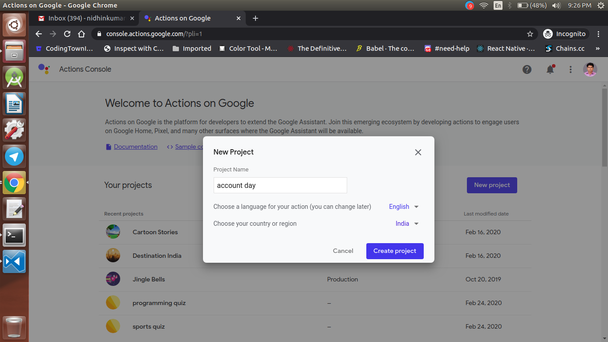
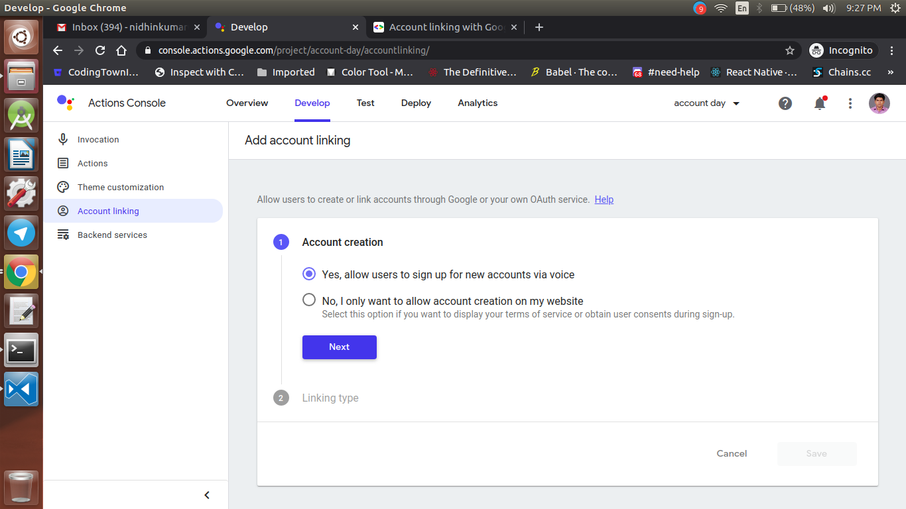
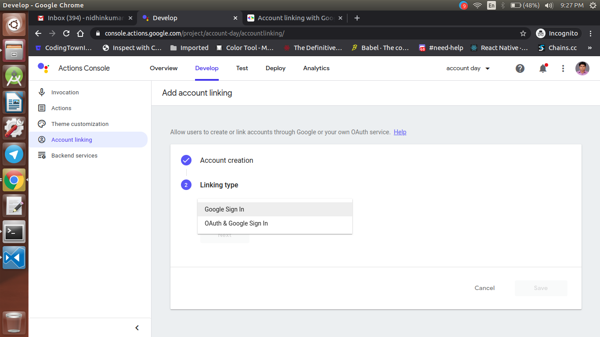
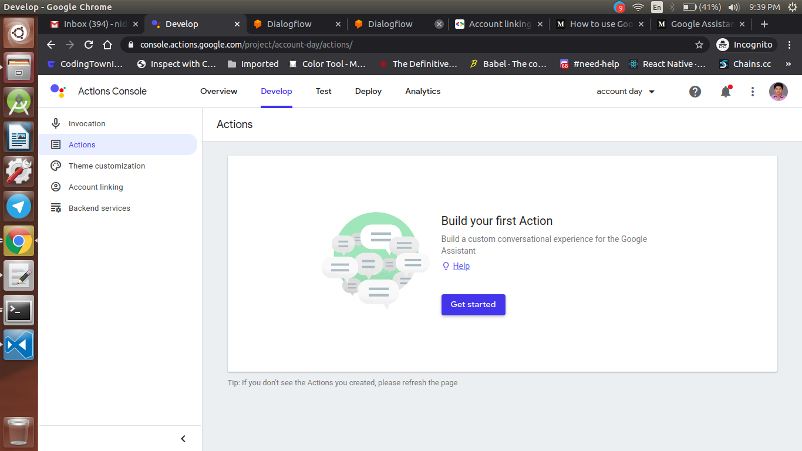
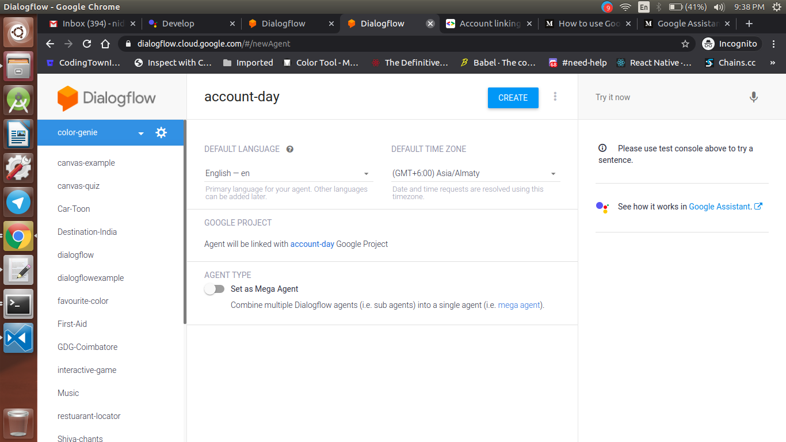
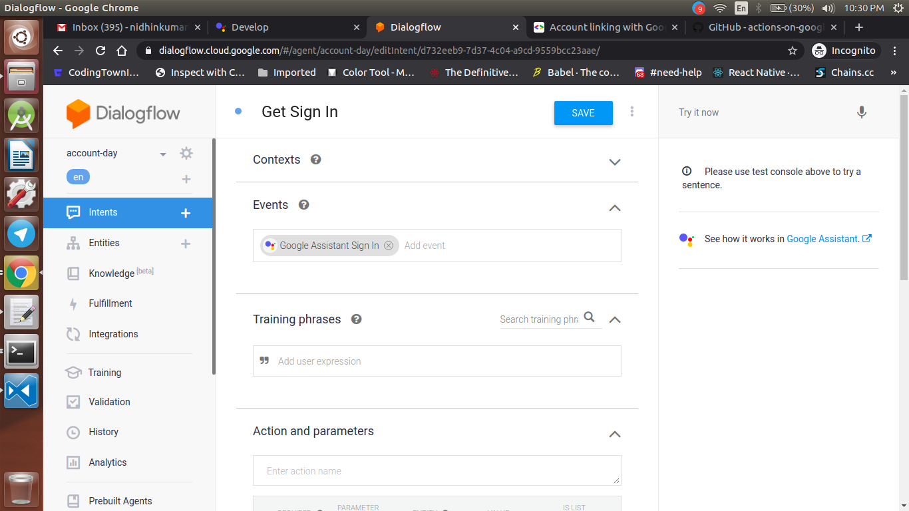

  <h1>Actions on Google - Day 9</h1>
  
PoC - Account Linking - Part 1

Google Account Linking in AoG

Step 1:  Create an action like below

 

   

Step 2: Once the project is created select the account linking options like below

   

Step 3: Select the Google Signin as the Linking type

   

Step 4: Click the custom action button

   

Step 5: Open the dialogflow like below

   

Step 6: Create a new intent called Get Sign In and in the events select Google Assistant Signin and enable webhook for that event

   

# Resource Links

* Medium - `https://medium.com/google-developer-experts/how-to-use-google-sign-in-for-the-assistant-b818f3de9211`

* AoG Resource - `https://developers.google.com/assistant/identity/google-sign-in#nodejs`

* AoG-Nodejs-GitHub - `https://github.com/actions-on-google/dialogflow-google-sign-in-nodejs`